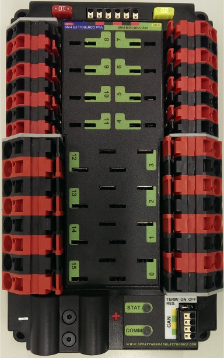
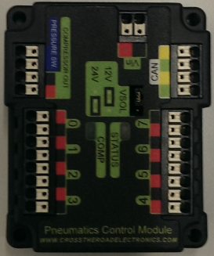
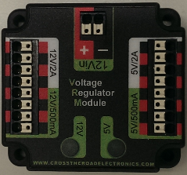
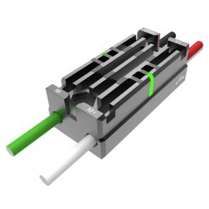
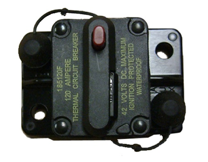

.. include:: <isonum.txt>

Visão geral do Hardware do Sistema de Controle de FRC\ |reg|
============================================================

O objetivo desse documento é fornecer uma breve visão geral dos componentes de hardware que compõem o Sistema de Controle de FRC\ |reg|. Cada componente vai conter uma breve descrição da função do componente, uma breve lista de conexões críticas, e um link para mais documentação se disponível.

.. note:: Para instruções/diagramas de fiação completos, acesse o documento :doc:`Fiação do Sistema de Controle <how-to-wire-a-robot>`.

National Instruments roboRIO
----------------------------

O NI-roboRIO é o principal controlador de robô usado para FRC. O roboRIO inclui um processador dual-core ARM Cortex™-A9 e FPGA que executa os elementos confiáveis ​​para controle e segurança, bem como o código gerado pela equipe. O Controlador integrado I/O inclui uma variedade de protocolos de comunicação (Ethernet, USB, CAN, SPI, I2C, e serial) como PWM, servo, digital I/O, e canais analógicos I/O usados para conectar os periféricos do robô para detecção e controle. O roboRIO deve conectar-se à porta de 12V no power distribuition panel. A comunicação com fio está disponível via USB ou Ethernet. Informações detalhadas sobre o roboRIO podem ser encontradas no `Manual do Usuário do roboRIO <https://www.ni.com/pdf/manuals/374474a.pdf>`__.

Power Distribution Panel
------------------------

A Power Distribution Panel (PDP) foi projetada para distribuir energia de uma bateria 12VDC para vários componentes do robô por meio de disjuntores com redefinição automática e um pequeno número de conexões com funções especiais. A PDP oferece 8 pares de saída classificados para corrente contínua de 40A e 8 pares classificados para corrente contínua de 30A. A PDP oferece conectores dedicados de 12V para o roboRIO, bem como conectores para o Voltage Regulator Module (VRM) e para o Pneumatics Control Module (PCM). Ela também inclui uma interface CAN para registrar a corrente, temperatura e tensão da bateria. Para informações mais detalhadas, consulte o `PDP User Manual <https://www.ctr-electronics.com/downloads/pdf/PDP%20User's%20Guide.pdf>`__.

Pneumatics Control Module
-------------------------

A PCM é um dispositivo que contém todas as entradas e saídas necessárias para operar solenóides pneumáticas de 12V ou 24V e o compressor. A PCM é ativada/desativada pelo roboRIO através da interface CAN. A PCM contém uma entrada para o sensor de pressão e controlará o compressor automaticamente quando o robô estiver ativado e uma solenóide tiver sido criado no código. O dispositivo também coleta informações de diagnóstico, como o estado das solenóides, o estado do sensor de pressão, e o estado do compressor. O módulo inclui LEDs de diagnóstico para os canais de solenóide e CAN individualmente. Para mais informações, consulte o `Manual do Usuário da PCM <https://www.ctr-electronics.com/downloads/pdf/PCM%20User's%20Guide.pdf>`__.

Voltage Regulator Module
------------------------

O VRM é um módulo independente que é alimentado por 12 volts. O dispositivo está conectado a um conector dedicado a ele na PDP. O módulo possui várias saídas reguladas de 12V e 5V. O objetivo do VRM é fornecer energia regulada para o rádio do robô, circuitos personalizados e câmeras de visão IP. Os dois pares de conectores associados a cada etiqueta têm uma classificação combinada do que a etiqueta indica (por exemplo, 5V / 500mA total para ambos os pares, não para cada par). O limite de 12V / 2A é uma classificação de pico, a fonte não deve ser carregada com mais de 1,5A de corrente contínua. Para mais informações, consulte o `Manual do Usuário do VRM <https://www.ctr-electronics.com/VRM%20User's%20Guide.pdf>`__.

Controladores de Motor
-----------------------

Há uma variedade de controladores de motor diferentes que funcionam com o sistema de controle FRC e são aprovados para uso. Esses dispositivos são usados ​​para fornecer controle de tensão variável dos Brushed DC Motors usados ​​na FRC. Eles estão listados aqui em ordem alfabética.

Controlador SPARK Motor
^^^^^^^^^^^^^^^^^^^^^^^^

O Controlador SPARK Motor da REV Robotics é um controlador Speed Motor para uso na FRC. O SPARK é controlado utilizando a interface PWM. Os Limit switches podem ser conectados diretamente ao SPARK para limitar o deslocamento do motor em uma ou ambas as direções. O LED de status RGB exibe o estado atual do dispositivo, incluindo se o dispositivo está atualmente em Brake mode ou Coast mode. Para mais informações, acesse o `Página do produto REV Robotics SPARK <https://www.revrobotics.com/rev-11-1200/>`__

SPARK MAX Motor Controller
^^^^^^^^^^^^^^^^^^^^^^^^^^

O Controlador SPARK MAX Motor da REV Robotics é um controlador Speed Motor para uso na FRC. O SPARK MAX é capaz de controlar tanto os tradicionais Brushed DC Motors comumente usados na FRC ou o novo Brushless REV Robotics NEO Brushless Motor. O SPARK MAX pode ser controlado por meio da PWM, CAN ou USB (para configuração/testagem apenas). O controlador possui uma porta de dados para entrada do sensor e é capaz de assumir modos de closed loop control quando controlado por meio CAN ou USB. Para mais informações, acesse `Página do Produto REV Robotics SPARK MAX <https://www.revrobotics.com/rev-11-2158/>`__.

Controlador Talon Motor
^^^^^^^^^^^^^^^^^^^^^^^^

O Controlador Talon Motor pela Cross the Road Electronics é um controlador Speed Motor para uso na FRC. O Talon é controlado por meio de interface PWM . O Talon deve ser conectado a uma saída PWM do roboRIO e  alimentado pela Power Distribution Panel. Para mais informações, acesse o `Manual do Usuário do Talon <https://ctr-electronics.com/Talon_User_Manual_1_1.pdf>`__.

Talon SRX
^^^^^^^^^

O Controlador Talon SRX motor é um “controlador de motor inteligente” habilitado para CAN da Cross The Road Electronics/VEX Robotics. O Talon SRX possui um compartimento de metal eletricamente isolado para dissipação de calor, tornando opcional o uso de um ventilador. O Talon SRX pode ser controlado por meio CAN bus ou por interface PWM. Ao usar o controle CAN bus, esse dispositivo pode receber entradas de limit switches e potentiometers, encoders, ou sensores similares para executar um controle avançado como limitar ou PID(F) closed loop control no dispositivo. Para mais informações acesse o `Manual do Usuário do Talon SRX <https://www.ctr-electronics.com/talon-srx.html>`__.

.. note:: CAN Talon SRX foi removido do WPILib. Acesse `blog <https://www.firstinspires.org/robotics/frc/blog/2017-control-system-update>`__ para mais informações e encontre o Instalador CTRE Toolsuite `aqui <https://www.ctr-electronics.com/Talon%20SRX%20User's%20Guide.pdf>`__.

Controlador Victor 888 Motor / Controlador Victor 884 Motor
^^^^^^^^^^^^^^^^^^^^^^^^^^^^^^^^^^^^^^^^^^^^^^^^^^^^^^^^^^^^

O Controlador Victor 888 Motor da VEX Robotics é um controlador Speed Motor para uso na FRC. O Victor 888 substitui o Victor 884, que também pode ser utilizado na FRC. O Victor é controlado por interface PWM. O Victor deve ser conectado a uma saída PWM output do roboRIO e alimentado pela Power Distribution Panel. Para mais informações, acesse o `Manual do Usuário do Victor 884  <https://content.vexrobotics.com/docs/ifi-v884-users-manual-9-25-06.pdf>`__ e `Manual do Usuário do Victor 888 <https://content.vexrobotics.com/docs/217-2769-Victor888UserManual.pdf>`__.

Victor SP
^^^^^^^^^

O Victor SP motor é um controlador PWM da Cross The Road Electronics/VEX Robotics. O Victor SP possui uma carcaça de metal eletricamente isolada para dissipação de calor, tornando opcional o uso do ventilador. O dispositivo é selado para impedir que detritos entrem no controlador. O controlador é aproximadamente metade do tamanho dos modelos anteriores.

Victor SPX
^^^^^^^^^^

O Victor SPX motor é um controlador de motor por meio CAN ou PWM da Cross The Road Electronics/VEX Robotics. O dispositivo é conectado para permitir a fácil conexão com o os conectores roboRIO, PWM  ou CAN bus chain. Quando controlado por meio CAN bus, o dispositivo tem um número de recursos de closed loop também presente no Talon SRX. O dispositivo é selado para impedir que detritos entrem no controlador. Para mais informações, acesse a `Victor SPX Webpage <https://www.vexrobotics.com/217-9191.html>`__.

.. note:: O controlador Victor SPX CAN não é suportado pelo WPILib. Acesse `this blog <https://www.firstinspires.org/robotics/frc/blog/2017-control-system-update>`__ para mais informações e encontre o instalador CTRE Toolsuite `aqui <https://www.ctr-electronics.com/control-system/hro.html#product_tabs_technical_resources>`__.

Spike H-Bridge Relay
--------------------

O Spike H-Bridge Relay da VEX Robotics é um dispositivo usado para controlar a energia de motores ou outros componentes eletrônicos de robôs personalizados. Quando conectado a um motor, o Spike oferece On/Off control nas direções direta e reversa. As saídas do Spike outputs são independentemente controladas portanto também pode ser usado para fornecer energia para até 2 circuitos eletrônicos personalizados. O Spike H-Bridge Relay deve ser conectado a uma saída relay do roboRIO e alimentado pela Power Distribution Panel. Para mais informaçõ `Guia do Uusário do Spike <https://content.vexrobotics.com/docs/spike-blue-guide-sep05.pdf>`__.

Servo Power Module
------------------

O Servo Power Module da Rev Robotics é capaz de expandir a energia disponível para os servos além do que a fonte de alimentação integrada do roboRIO é capaz. O Servo Power Module fornece até 90W de potência de 6V em 6 canais. Todos os sinais de controle são transmitidos diretamente do roboRIO. Para mais informações, acesse a `Servo Power Module Webpage <https://www.revrobotics.com/rev-11-1144/>`__.

Microsoft Lifecam HD3000
------------------------

A Microsoft Lifecam HD3000 é uma webcam USB que pode ser conectada diretamente ao roboRIO. A câmera é capaz de capturar vídeo de até 1280x720 a 30 FPS. Para mais informações sobre a câmera, consulte a `Página do produto Microsoft <https://www.microsoft.com/accessories/en-us/products/webcams/lifecam-hd-3000/t3h-00011#support>`__. Para obter mais informações sobre o uso da câmera com o roboRIO, consulte a seção :ref:`Vision Processing <docs/software/vision-processing/index:Vision Processing>`deste documento.

OpenMesh OM5P-AN or OM5P-AC Radio
---------------------------------

Ambos os OpenMesh OM5P-AN e OpenMesh OM5P-AC wireless radio são utilizados como o rádio do robô para fornecer funcionalidade de comunicação wireless ao robô. O dispositivo pode ser configurado como um ponto de acesso para conexão direta de um laptop para uso doméstico. Também pode ser configurado como Bridge para uso em campo. O rádio do robô deve ser alimentado por uma das saídas de 12V / 2A no VRM e conectado ao controlador roboRIO por Ethernet. Para mais informações, acesse :ref:`Programando seu Rádio <docs/getting-started/getting-started-frc-control-system/radio-programming:Programming your Radio>`.

O OM5P-AN `não está mais disponível para compra <https://www.firstinspires.org/robotics/frc/blog/radio-silence>`__. O OM5P-AC é um pouco mais pesado, possui mais grades de resfriamento e possui uma textura superficial áspera em comparação com o OM5P-AN.

120A Circuit Breaker
--------------------

O 120A Main Circuit Breaker oferece duas funções no robô: a principal power switch do robô e um dispositivo de proteção para a fiação e os componentes do robô. O disjuntor 120A é conectado aos terminais positivos da bateria do robô e dos quadros de distribuição de energia. Para mais informações, acesse a `Ficha de dados Cooper Bussmann 18X Series (PN: 185120F) <http://www.cooperindustries.com/content/dam/public/bussmann/Transportation/Circuit%20Protection/resources/datasheets/BUS_Tns_DS_18X_CIRCUITBREAKER.pdf>`__

Snap Action Circuit Breakers
----------------------------

As nap Action circuit breakers, MX5-A40 and VB3 series, são usadas com a Power Distribution Panel para limitar a corrente aos circuitos de derivação. A MX5-A40 40A MAXI style circuit breaker é usada com os canais maiores na Power Distribution Panel para alimentar cargas que consomem corrente de até 40A. A VB3 series são usados ​​com os canais menores no PDP para alimentar os circuitos com corrente de 30 A ou menos. Para mais informações, acesse as fichas de dados para a `MX5 series <http://www.snapaction.net/pdf/MX5%20Spec%20Sheet.pdf>`__ e `VB3 Series <http://www.snapaction.net/pdf/vb3.pdf>`__.

Robot Battery
-------------

A fonte de alimentação de um robô de FRC é uma única bateria de 12V 18Ah. As baterias usadas para FRC são baterias de chumbo-ácido seladas, capazes de atender às altas demandas de corrente de um robô FRC. Para obter mais informações, consulte os dados para o `MK ES17-12 <https://www.batteryuniverse.com/msds/sealed-lead-acid-msds.pdf>`__ e `nersys NP18-12 <https://www.enersys.com/WorkArea/DownloadAsset.aspx?id=488>`__.

.. note:: Outros números de peça da bateria podem ser legais, consulte o `Manual FRC <https://www.firstinspires.org/resource-library/frc/competition-manual-qa-system>`__ para uma lista completa.

Crédito das Imagens
--------------------

Imagem do roboRIO, cortesia da National Instruments. Imagens do Talon SRX, Victor 888, Victor SP, Victor SPX, e Spike H-Bridge Relay cortesia da VEX Robotics, Inc. Imagem do SPARK MAX cortesia da REV Robotics. Imagens da Lifecam, PDP, PCM, SPARK, e VRM cortesia da *FIRST*\ |reg|. Todas as outras fotos são cortesia da AndyMark Inc.
