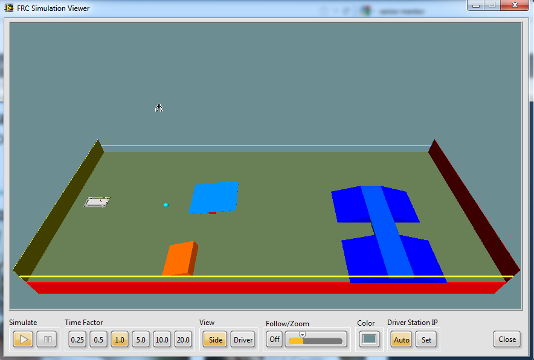
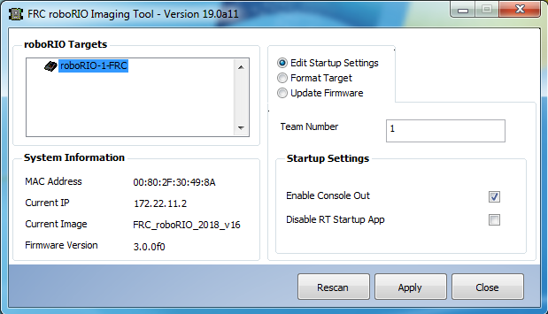
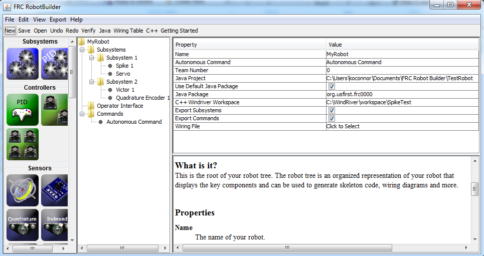
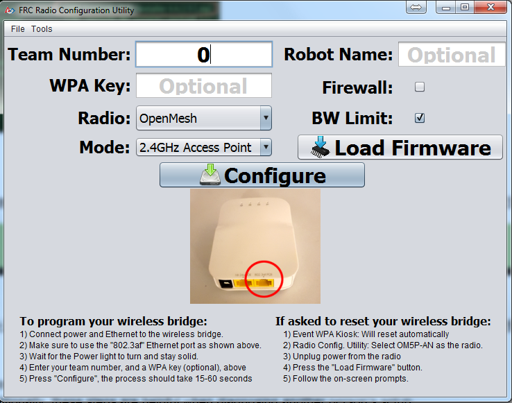

Visão Geral do Componente de Software FRC
=========================================

O sistema de controle FRC consiste em uma ampla variedade de componentes de software obrigatórios e opcionais. Estes elementos foram projetados para ajudá-lo no design, desenvolvimento, e depuração do código do robô, bem como, ajudar no controle operacional do robô e fornecer um feedback ao solucionar problemas. Para cada componente do software este documento fornecerá uma breve visão geral de sua finalidade, um link para o download do pacote, se apropriado, e um link para a documentação adicional, quando disponível.

Compatibilidade com o Sistema Operacional
-----------------------------------------

O sistema operacional principal com suporte para componentes FRC é o Windows. Todos os componentes de software FRC necessários foram testados no Windows 7, 8 e 10. O Windows XP não é suportado.

Dito isso, muitas das ferramentas para programação C ++ / Java também são suportadas e testadas no macOS e Linux. As equipes de programação em C ++ / Java poderão desenvolver usando esses sistemas, usando um sistema Windows para operações apenas do Windows, como Driver Station, programação de rádio e imagem roboRIO.

LabVIEW FRC (Somente Windows)
-----------------------------

.. image:: images/control-system-software/labview-frc.png

LabVIEW FRC, baseado no LabVIEW 2019 da National Instruments, é o ambiente de desenvolvimento do LabVIEW, uma das três linguagens oficialmente suportadas para a programação de um robô FRC. O LabVIEW é uma linguagem gráfica orientada a fluxo de dados. Os programas LabVIEW consistem em uma coleção de ícones, chamados VIs, conectados com fios que passam dados entre os VIs. O instalador do LabVIEW FRC é distribuído em um DVD encontrado no Kickoff Kit de peças e também está disponível para download (consulte a página de instruções de instalação vinculada abaixo). Instruções para instalar as bibliotecas FRC (o pacote também inclui Driver Station e Utilitários) podem ser encontradas :ref:`aqui <docs/getting-started/getting-started-frc-control-system/frc-game-tools:Installing the FRC Game Tools>`. Um guia para começar a usar o software LabVIEW FRC, incluindo instruções de instalação, pode ser encontrado :ref:`aqui <docs/getting-started/getting-started-frc-control-system/labview-setup:Installing LabVIEW for FRC (LabVIEW only)>`.

Simulador de robô FRC (Somente Windows)
^^^^^^^^^^^^^^^^^^^^^^^^^^^^^^^^^^^^^^^

O simulador de robô FRC é um componente do ambiente de programação LabVIEW que permite operar um robô predefinido em um ambiente simulado para testar o código e/ou funções da Driver Station. Ele utiliza um projeto de código do LabVIEW como o código do robô e se comunica com a FRC Driver Station para controle do robô e o Painel de Controle padrão FRC para feedback do robô. O simulador de robô FRC é instalado com o pacote LabVIEW FRC. Informações sobre o uso do simulador de robô FRC podem ser encontradas abrindo o arquivo simulação do robô Readme.html no Explorador de Projetos do LabVIEW.

Visual Studio Code
------------------

.. image:: images/control-system-software/visual-studio-code.png

O Visual Studio Code é o ambiente de desenvolvimento suportado para C ++ e Java, duas das três linguagens suportadas usadas para programar um robô FRC. Ambas linguagens de programação baseadas em texto orientadas a objetos. Um programa em C ++ (para FRC) consiste em vários arquivos de cabeçalho (.h) e de implementação (.cpp), enquanto um programa em Java consiste em arquivos .java contidos em um ou mais pacotes. Um guia para começar a usar o C ++ para FRC, incluindo a instalação e configuração do Visual Studio Code, pode ser encontrado :doc:`aqui <offline-installation-preparations>`.

Driver Station da FRC fornecida pela NI LabVIEW (Somente Windows)
-----------------------------------------------------------------

.. image:: images/control-system-software/frc-driver-station.png

A Driver Station da FRC desenvolvido pelo NI LabVIEW é o único software permitido para ser usado com o objetivo de controlar o estado do robô durante a competição. Este software contém o código necessário para enviar dados ao seu robô a partir de uma variedade de dispositivos de entrada, como joysticks, gamepads e placas IO personalizáveis. Ele também contém várias ferramentas usadas para ajudar a solucionar problemas do robô, como indicadores de status e criação de arquivo de log. Instruções para instalar a Driver Station da FRC, fornecida pelo NI LabVIEW (incluída no FRC Game Tools, podem ser encontradas :ref:`aqui <docs/getting-started/getting-started-frc-control-system/frc-game-tools:Installing the FRC Game Tools>`.Mais informações sobre a estação de driver FRC, fornecida pelo NI LabVIEW, podem ser encontradas :ref:`here <docs/software/driverstation/driver-station:FRC Driver Station Powered by NI LabVIEW>`.

Painel FRC LabVIEW (somente Windows)
------------------------------------

.. image:: images/control-system-software/frc-labview-dashboard.png

.. todo:: port article, see https://github.com/wpilibsuite/frc-docs/issues/118

O FRC LabVIEW Dashboard é o programa padrão do painel instalado e iniciado automaticamente pela FRC Driver Station. O objetivo do painel é fornecer feedback sobre a operação do robô. O painel padrão da FRC serve como um exemplo dos tipos de feedback que as equipes podem desejar do robô. Ele inclui uma tela com guias que pode alternar entre a visualização de uma imagem de uma câmera no robô ou uma exibição das variáveis ​​doNetworkTables, uma exibição de informações sobre os joysticks e os motores de acionamento, um indicador do IP do robô e da tensão da bateria e uma segunda aba exibição que pode alternar entre exemplos de indicadores e controles personalizados, uma guia de teste para uso com o Modo de Teste da Driver Station e uma guia lista de verificação que as equipes podem usar para inserir uma lista de verificação personalizada para concluir antes de cada partida.  O painel padrão do FRC está incluído no FRC Game Tools. Instruções de instalação podem ser encontradas :ref:`aqui <docs/getting-started/getting-started-frc-control-system/frc-game-tools:Installing the FRC Game Tools>`. Mais informações sobre o software do painel padrão FRC podem ser encontradas aqui.

SmartDashboard
--------------

.. image:: images/control-system-software/smartdashboard.png

SmartDashboard is an alternate dashboard application written in Java. SmartDashboard automatically creates a widget for each variable sent from the Robot sent using the SmartDashboard class or VIs. These widgets can be configured to a number of preset display types, or users can create custom extensions in Java. Vision extensions are available for the SmartDashboard which allow it to display images from the Axis camera on the robot. SmartDashboard is included in the C++ and Java language updates (enabled by clicking the C++ or Java buttons respectively on the Setup tab of the Driver Station). Additional documentation on SmartDashboard can be found :ref:`here <docs/software/wpilib-tools/smartdashboard/index:SmartDashboard>`.

LiveWindow
^^^^^^^^^^

.. image:: images/control-system-software/livewindow-smartdashboard.png

LiveWindow is a mode of SmartDashboard , designed for use with the Test Mode of the Driver Station. LiveWindow allows the user to see feedback from sensors on the robot and control actuators independent of the written user code. More information about LiveWindow can be found :ref:`here <docs/software/wpilib-tools/smartdashboard/test-mode-and-live-window/index:SmartDashboard: Test Mode and Live Window>`.

Shuffleboard
------------

.. image:: images/control-system-software/shuffleboard.png

Shuffleboard is an alternative dashboard application written in Java. It takes many of the concepts from SmartDashboard such as automatic adding of widgets and adds new features including better layout control and record/playback functionality. Shuffleboard contains all of the basic widget types found in the SmartDashboard as well as a number of new ones intended to make visualizing specific robot components even easier. It has full integration with WPILib’s “cscore” for displaying, recording, and playing back camera streams. Shuffleboard is included in the C++ and Java language updates (enabled by selecting Shuffleboard from the dashboard type on the Setup tab of the Driver Station or by launching it from the WPILib start tool menu in Visual Studio Code). Additional documentation on Shuffleboard can be found :ref:`here <docs/software/wpilib-tools/shuffleboard/index:Shuffleboard>`.

FRC roboRIO Imaging Tool (Windows Only)
---------------------------------------

The FRC roboRIO Imaging Tool is a software tool used to format and setup an roboRIO-FRC device for use in FRC. The tool detects any roboRIO device on the network, reports the current MAC, name, IP and Image version. The tool allows the user to configure the team number, set options including Console Out and whether an applications runs on Startup, and install the latest software image on the device. The FRC roboRIO Imaging Tool is installed as part of the FRC Game Tools. Installation instructions can be found :ref:`here <docs/getting-started/getting-started-frc-control-system/frc-game-tools:Installing the FRC Game Tools>`. Additional instructions on imaging your roboRIO using this tool can be found :doc:`here <imaging-your-roborio>`.

Setup Axis Camera (Windows Only)
--------------------------------

.. image:: images/control-system-software/axis-camera-setup.png

The Setup Axis Camera utility is a LabVIEW program used to configure an Axis 206, M1011 or M1013 camera for use on the robot. The tool takes a factory reset camera connected directly to the computer and configures the IP, username and password, anonymous access, and default framerate and compression (for use with the SmartDashboard or other access methods). The Setup Axis Camera tool is installed as part of the FRC Game Tools. Installation instructions can be found :ref:`here <docs/getting-started/getting-started-frc-control-system/frc-game-tools:Installing the FRC Game Tools>`. Instructions for using the tool to configure the camera are located :ref:`here <docs/software/vision-processing/introduction/configuring-an-axis-camera:Configuring an Axis Camera>`.

FRC Driver Station Log Viewer (Windows Only)
--------------------------------------------

.. image:: images/control-system-software/frc-log-viewer.png

The FRC Driver Station Log Viewer is a LabVIEW program used to view logs created by the FRC Driver Station. These logs contain information such as battery voltage, trip time, CPU% and robot mode, as well as events such as joystick removal. The FRC Driver Station Log Viewer is included in the FRC Game Tools. Installation instructions can be found :ref:`here <docs/getting-started/getting-started-frc-control-system/frc-game-tools:Installing the FRC Game Tools>`. More information about the FRC Driver Station Log Viewer and understanding the logs can be found :ref:`here <docs/software/driverstation/driver-station-log-viewer:Driver Station Log File Viewer>`

RobotBuilder
------------

RobotBuilder is a tool designed to aid in setup and structuring of a Command Based robot project for C++ or Java. RobotBuilder allows you to enter in the various components of your robot subsystems and operator interface and define what your commands are in a graphical tree structure. RobotBuilder will then verify that you have no port allocation conflicts and can generate a wiring table indicating what is connected to each port as well as C++ or Java code. The code created generates the appropriate files, constructs the appropriate objects and adds LiveWindow code for each sensor and actuator, but does not write any of the actual Subsystem or Command methods. The user must write the appropriate code for these methods for the robot to function. More information about RobotBuilder can be found :ref:`here <docs/software/wpilib-tools/robotbuilder/index:RobotBuilder>`. More information about the Command Based programming architecture can be found :ref:`here <docs/software/commandbased/index:Command-Based Programming>`.

OutlineViewer
-------------

OutlineViewer is a utility used to view, modify and add to the contents of the NetworkTables for debugging purposes. It displays all key value pairs currently in the NetworkTables and can be used to modify the value of existing keys or add new keys to the table. OutlineViewer is included in the C++ and Java language updates (found in ``\tools\wpilib``. Teams may need to install the Java Runtime Environment to use the OutlineViewer on computers not set up for Java programming.

To connect to your robot, open OutlineViewer and set the “Server Location” to be your team number. After you click start, OutlineViewer will connect.

LabVIEW teams can use the Variables tab of the LabVIEW Dashboard to accomplish this functionality.

FRC Radio Configuration Utility (Windows Only)
----------------------------------------------

The FRC Radio Configuration Utility is a tool used to configure the the OpenMesh OM5P-AN or OM5P-AC radio for practice use at home. This tool sets the appropriate IP, and network settings for proper network connection, as well as the QOS settings required to mimic the bandwidth limiting and packet prioritization experience on the FRC playing field. The FRC Radio Configuration Utility is installed by a standalone installer, instructions on installing and using the FRC Radio Configuration Utility to configure your radio can be found :ref:`here <docs/getting-started/getting-started-frc-control-system/radio-programming:Programming your Radio>`.
