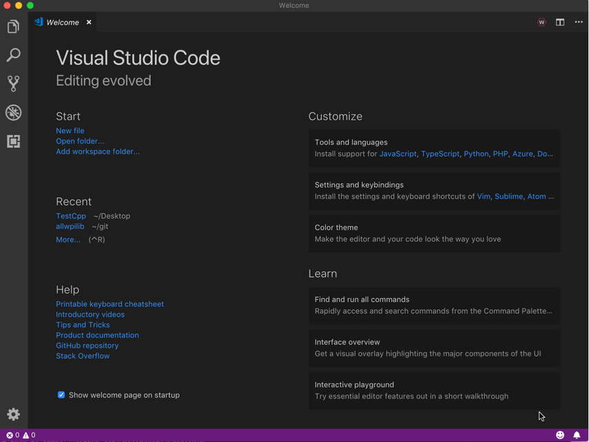
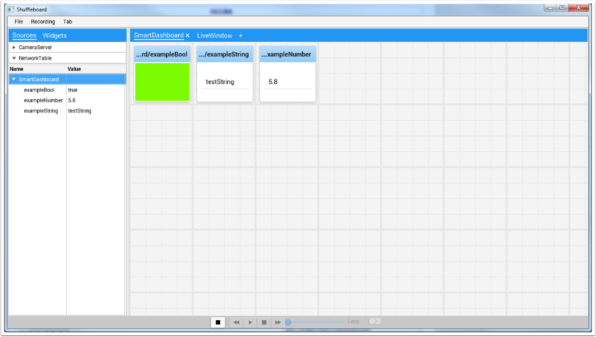
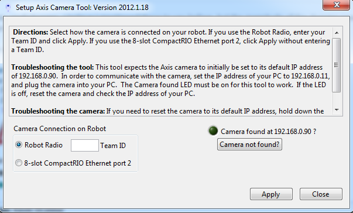

Visão Geral dos Softwares de programação para FRC
=================================================

O sistema de controle FRC consiste em uma ampla variedade de componentes de software obrigatórios e opcionais. Estes elementos foram projetados para ajudá-lo no design, desenvolvimento, e depuração do código do robô, bem como, ajudar no controle operacional do robô e fornecer um feedback ao solucionar problemas. Para cada componente do software, este documento fornecerá uma breve visão geral de sua finalidade, um link para o download do pacote, se apropriado, e um link para a documentação adicional, quando disponível.

Compatibilidade com o Sistema Operacional
-----------------------------------------

O sistema operacional principal com suporte para componentes FRC é o Windows. Todos os componentes de software FRC necessários foram testados no Windows 7, 8 e 10. O Windows XP não é suportado.

Dito isso, muitas das ferramentas para programação C ++ / Java também são suportadas e testadas no macOS e Linux. As equipes que oprarem por programar em C ++ / Java poderão desenvolver usando esses sistemas, usando um sistema Windows para operações como a Driver Station, a configuração do rádio e a formatação do roboRIO.

LabVIEW para FRC (Somente Windows)
-----------------------------

.. image:: images/control-system-software/labview-frc.png

LabVIEW para FRC, baseado no LabVIEW 2019 da National Instruments, é o ambiente de desenvolvimento do LabVIEW, uma das três linguagens oficialmente suportadas para a programação de um robô de FRC. O LabVIEW é uma linguagem gráfica orientada a fluxo de dados. Os programas no LabVIEW consistem em uma coleção de ícones, chamados VIs, conectados com fios que passam dados entre os VIs. O instalador do LabVIEW FRC é distribuído em um DVD encontrado no Kit de peças e também está disponível para download (consulte a página de instruções de instalação vinculada abaixo).

 **Instruções para instalar as bibliotecas para FRC** (o pacote também inclui Driver Station e Utilitários) podem ser encontradas :ref:`aqui <docs/getting-started/getting-started-frc-control-system/frc-game-tools:Installing the FRC Game Tools>`. Um guia para começar a usar o software LabVIEW FRC, incluindo instruções de instalação, pode ser encontrado :ref:`aqui <docs/getting-started/getting-started-frc-control-system/labview-setup:Installing LabVIEW for FRC (LabVIEW only)>`.

Simulador de robô FRC (Somente Windows)
^^^^^^^^^^^^^^^^^^^^^^^^^^^^^^^^^^^^^^^

.. image:: images/control-system-software/robot-simulator.png

O simulador de robô FRC é um componente do ambiente de programação LabVIEW que permite operar um robô predefinido em um ambiente simulado para testar o código e/ou funções da Driver Station. Ele utiliza um projeto de código do LabVIEW como o código do robô e se comunica com a Driver Station para controle do robô e a Dashboard padrão para feedback do robô. O simulador de robô FRC é instalado com o pacote do LabVIEW para FRC. Informações sobre o uso do simulador de robô FRC podem ser encontradas abrindo o arquivo simulação do robô Readme.html no Explorador de Projetos do LabVIEW.

Visual Studio Code
------------------

O Visual Studio Code é o ambiente de desenvolvimento suportado para C ++ e Java, duas das três linguagens suportadas usadas para programar um robô FRC. Ambas linguagens de programação baseadas em texto orientadas a objetos. Um programa em C ++ (para FRC) consiste em vários arquivos de cabeçalho (.h) e de implementação (.cpp), enquanto um programa em Java consiste em arquivos .java contidos em um ou mais pacotes. Um guia para começar a usar o C ++ para FRC, incluindo a instalação e configuração do Visual Studio Code, pode ser encontrado :doc:`aqui <offline-installation-preparations>`.

Driver Station da FRC fornecida pela NI LabVIEW (Somente Windows)
-----------------------------------------------------------------

.. image:: images/control-system-software/frc-driver-station.png

A Driver Station da FRC desenvolvido pelo NI LabVIEW é o único software permitido para ser usado com o objetivo de controlar o estado do robô durante a competição. Este software contém o código necessário para enviar dados ao seu robô a partir de uma variedade de dispositivos de entrada, como joysticks, gamepads e placas IO personalizáveis. Ele também contém várias ferramentas usadas para ajudar a solucionar problemas do robô, como indicadores de status e criação de arquivo de log. Instruções para instalar a Driver Station da FRC, fornecida pelo NI LabVIEW (incluída no FRC Game Tools, podem ser encontradas :ref:`aqui <docs/getting-started/getting-started-frc-control-system/frc-game-tools:Installing the FRC Game Tools>`.Mais informações sobre a estação de driver FRC, fornecida pelo NI LabVIEW, podem ser encontradas :ref:`aqui <docs/software/driverstation/driver-station:FRC Driver Station Powered by NI LabVIEW>`.

Painel FRC LabVIEW (somente Windows)
------------------------------------

.. image:: images/control-system-software/frc-labview-dashboard.png

.. todo:: port article, see https://github.com/wpilibsuite/frc-docs/issues/118

O FRC LabVIEW Dashboard é o programa padrão do painel instalado e iniciado automaticamente pela FRC Driver Station. O objetivo do painel é fornecer feedback sobre a operação do robô. O painel padrão da FRC serve como um exemplo dos tipos de feedback que as equipes podem desejar do robô. Ele inclui uma tela com guias que pode alternar entre a visualização de uma imagem de uma câmera no robô ou uma exibição das variáveis ​​do NetworkTables, uma exibição de informações sobre os joysticks e os motores de acionamento, um indicador do IP do robô e da tensão da bateria e uma segunda aba exibição que pode alternar entre exemplos de indicadores e controles personalizados, uma guia de teste para uso com o Modo de Teste da Driver Station e uma guia lista de verificação que as equipes podem usar para inserir uma lista de verificação personalizada para concluir antes de cada partida.  O painel padrão do FRC está incluído no FRC Game Tools. Instruções de instalação podem ser encontradas :ref:`aqui <docs/getting-started/getting-started-frc-control-system/frc-game-tools:Installing the FRC Game Tools>`. Mais informações sobre o software do painel padrão FRC podem ser encontradas aqui.

SmartDashboard
--------------

O SmartDashboard é um aplicativo de painel alternativo escrito no Java. O SmartDashboard cria automaticamente uma ferramenta para cada variável enviada do robô enviado usando a classe ou VIs do SmartDashboard. Essas ferramentas podem ser configuradas para vários tipos de exibição predefinidos ou os usuários podem criar extensões personalizadas em Java. As extensões de visão estão disponíveis para o SmartDashboard, que permite exibir imagens da câmera Axis no robô. O SmartDashboard está incluído nas atualizações de linguagem C ++ e Java (ativadas clicando nos botões C ++ ou Java, respectivamente, na guia Configuração do Driver Station). Documentação adicional no SmartDashboard pode ser encontrada :ref:`aqui <docs/software/wpilib-tools/smartdashboard/index:SmartDashboard>`.

LiveWindow
^^^^^^^^^^

.. image:: images/control-system-software/livewindow-smartdashboard.png

O LiveWindow é um modo do SmartDashboard, projetado para uso com o Modo de Teste da Driver Station. O LiveWindow permite que o usuário veja o feedback dos sensores no robô e nos atuadores de controle, independentemente do código do usuário. Mais informações sobre o LiveWindow podem ser encontradas :ref:`aqui <docs/software/wpilib-tools/smartdashboard/test-mode-and-live-window/index:SmartDashboard: Test Mode and Live Window>`.

Shuffleboard
------------

Shuffleboard é um aplicativo de painel alternativo escrito em Java. É preciso muitos dos conceitos do SmartDashboard, como adição automática de widgets e novos recursos, incluindo melhor controle de layout e funcionalidade de gravação / reprodução. O Shuffleboard contém todos os tipos básicos de widgets encontrados no SmartDashboard, além de vários novos destinados a tornar a visualização de componentes de robôs específicos ainda mais fácil. Possui total integração com o “cscore” do WPILib para exibir, gravar e reproduzir fluxos de câmera. O Shuffleboard está incluído nas atualizações de linguagem C ++ e Java (habilitado selecionando Shuffleboard no tipo de painel na guia Configuração do Driver Station ou iniciando-o no menu da ferramenta de inicialização WPILib no Visual Studio Code). Documentação adicional no Shuffleboard pode ser encontrada :ref:`aqui <docs/software/wpilib-tools/shuffleboard/index:Shuffleboard>`.

Ferramenta de imagem FRC roboRIO (Somente Windows)
--------------------------------------------------

.. image:: images/imaging-your-roborio/roborio-imaging-tool.png

A FRC roboRIO Imaging Tool é uma ferramenta de software usada para formatar e configurar um dispositivo roboRIO-FRC para uso no FRC. A ferramenta detecta qualquer dispositivo roboRIO na rede, relata o MAC atual, nome, IP e versão da imagem. A ferramenta permite que o usuário configure o número da equipe, defina opções como Saída do console e se um aplicativo é executado na inicialização e instale a imagem mais recente do software no dispositivo. A FRC roboRIO Imaging Tool é instalada como parte do FRC Game Tools. As instruções de instalação podem ser encontradas :ref:`aqui <docs/getting-started/getting-started-frc-control-system/frc-game-tools:Installing the FRC Game Tools>`. Instruções adicionais sobre como criar imagens do seu roboRIO usando esta ferramenta podem ser encontradas :doc:`aqui <imaging-your-roborio>`.

Configuração da câmera Axis (Somente Windows)
---------------------------------------------

O utilitário Configuração da Câmera Axis é um programa do LabVIEW usado para configurar uma câmera Axis 206, M1011 ou M1013 para uso no robô. A ferramenta utiliza uma câmera de redefinição de fábrica conectada diretamente ao computador e configura o IP, nome de usuário e senha, acesso anônimo e taxa de quadros padrão e compressão (para uso com o SmartDashboard ou outros métodos de acesso). A ferramenta Setup Axis Camera é instalada como parte do FRC Game Tools. As instruções de instalação podem ser encontradas :ref:`aqui <docs/getting-started/getting-started-frc-control-system/frc-game-tools:Installing the FRC Game Tools>`. As instruções para usar a ferramenta para configurar a câmera estão localizadas :ref:`aqui <docs/software/vision-processing/introduction/configuring-an-axis-camera:Configuring an Axis Camera>`.

Visualizador de Registros da FRC Driver Station (Somente Windows)
-----------------------------------------------------------------

.. image:: images/control-system-software/frc-log-viewer.png

O Visualisador de Registros da FRC Driver Station é um programa LabVIEW usado para visualizar registros criados pelo FRC Driver Station. Esses registros contêm informações como voltagem da bateria, tempo de disparo, CPU% e modo do robô, além de eventos como remoção do joystick. O visualisador de registro da FRC Driver Station está incluído no FRC Game Tools. As instruções de instalação podem ser encontradas :ref:`aqui <docs/getting-started/getting-started-frc-control-system/frc-game-tools:Installing the FRC Game Tools>`. Mais informações sobre o visualizador de registros da estação de driver FRC e a compreensão dos registros podem ser encontradas :ref:`aqui <docs/software/driverstation/driver-station-log-viewer:Driver Station Log File Viewer>`.

RobotBuilder
------------

.. image:: images/control-system-software/robot-builder.png

O RobotBuilder é uma ferramenta projetada para ajudar na configuração e estruturação de um projeto de robô baseado em comando para C ++ ou Java. O RobotBuilder permite que você insira os vários componentes dos subsistemas do robô e da interface do operador e defina quais são seus comandos em uma estrutura de árvore gráfica. O RobotBuilder verificará que você não possui conflitos de alocação de porta e pode gerar uma tabela de ligações indicando o que está conectado a cada porta, bem como o código C ++ ou Java. O código criado gera os arquivos apropriados, constrói os objetos apropriados e adiciona o código do LiveWindow para cada sensor e atuador, mas não grava nenhum dos métodos reais de subsistema ou comando. O usuário deve escrever o código apropriado para esses métodos para o robô funcionar. Mais informações sobre o RobotBuilder podem ser encontradas :ref:`aqui <docs/software/wpilib-tools/robotbuilder/index:RobotBuilder>`. Mais informações sobre a arquitetura de programação baseada em comando podem ser encontradas :ref:`aqui <docs/software/commandbased/index:Command-Based Programming>`.

OutlineViewer
-------------

.. image:: images/control-system-software/outline-viewer.png

O OutlineViewer é um utilitário usado para exibir, modificar e adicionar ao conteúdo das Tabelas de Rede para fins de depuração. Ele exibe todos os pares de valores de chave atualmente nas tabelas de rede e pode ser usado para modificar o valor das chaves existentes ou adicionar novas chaves para a tabela. O OutlineViewer está incluído nas atualizações de linguagem C ++ e Java (encontradas em ``\tools\wpilib``. As equipes talvez precisarão instalar o Java Runtime Environment para usar o OutlineViewer em computadores não configurados para programação Java.

Para conectar-se ao seu robô, abra OutlineViewer e defina a "localização do servidor" como o seu número da sua equipe. Depois de clicar iniciar, OutlineViewer se conectará.

As equipes do LabVIEW podem usar a guia Variáveis do LabVIEW Dashboard para realizar essa funcionalidade.

Utilitário de configuração de rádio FRC (Somente Windows)
---------------------------------------------------------

.. image:: images/control-system-software/frc-radio-configuration-utility.png

O FRC Radio Configuration Utility é uma ferramenta usada para configurar o rádio OpenMesh OM5P-AN ou OM5P-AC para uso prático em casa. Essa ferramenta define as configurações de IP e de configurações de rede para a conexão de rede adequada, bem como as configurações de QOS necessárias para imitar a experiência de limitação de largura de banda e priorização de pacotes no campo de jogo do FRC. O utilitário de configuração de rádio FRC é instalado por um instalador autônomo; instruções sobre a instalação e o uso do utilitário de configuração de rádio FRC para configurar seu rádio podem ser encontradas :ref:`aqui <docs/getting-started/getting-started-frc-control-system/radio-programming:Programming your Radio>`.
