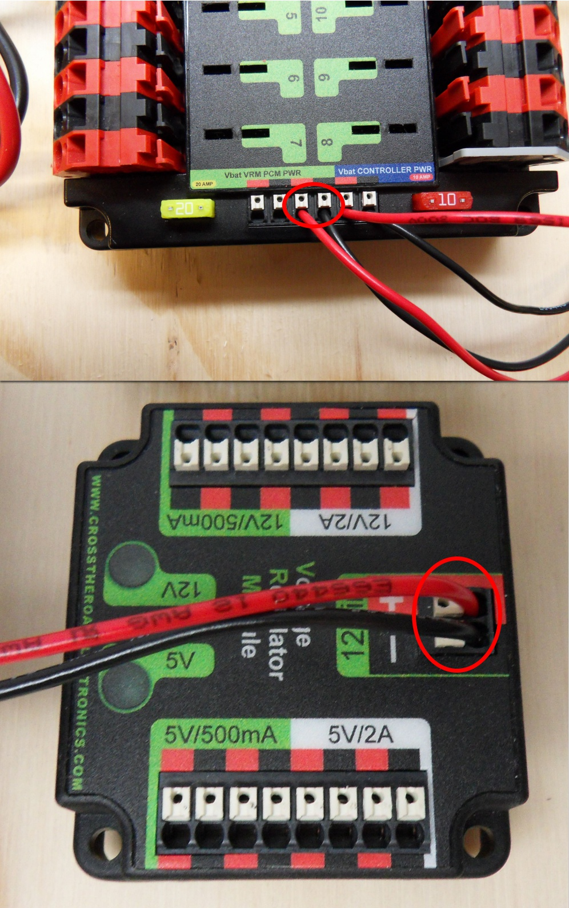
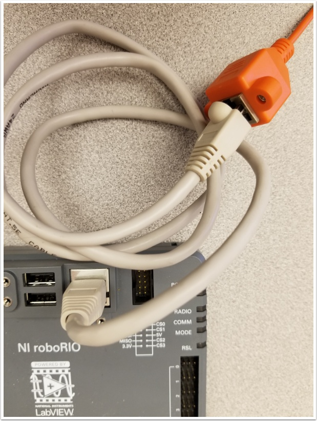

Como fazer o cabeamento de um robo para FRC
===========================================

.. note::

   Este documento descreve como fazer o cabeamento de uma chapa com componentes eletrônicos para testes.

   Algumas das imagens presentes nessa seção demonstram o Setup do sistema de controle de um robô que utiliza controladores de motor Spark. Os diagramas e layouts do cabeamento a seguir são bem parecidos com o dos demais controladores. Há também um segundo set de imagens que demonstram o passo a passo do cabeamento de controladores PWM com fios integrados.

Materiais e componentes
-----------------------

Você vai precisar dos seguintes componentes eletrônicos e ferramentas

- Mateirais do KIT:

      - Power Distribution Panel (PDP)
      - roboRIO
      - Pneumatics Control Module (PCM)
      - Voltage Regulator Module (VRM)
      - OpenMesh radio (com seu cabo de alimentação POE)
      - Robot Signal Light (RSL)
      - 4x Victor SPX ou outro controlador de motor
      - 120A Circuit breaker
      - 4x 40A Circuit breaker
      - Fio vermelho e preto de 6 AWG
      - Fio vermelho e preto de 10 AWG
      - Fio vermelho e preto de 18 AWG
      - Fio amarelo e verde de 22AWG
      - 16x 10-12 AWG  terminais em olho (amarelos)
      - 2x Anderson SB50
      - Terminais em olho de 6 AWG
      - Baterida 12V
      - Fita isolante
      - Zip ties
      - Compensado de 1/2" ou 1/4". Ou Policarbonato

- Ferramentas nescessaárias:

      - Chave de fenda pequena
      - Chave de fenda muito pequena (do tipo utilizdado em ajuste de óculos)
      - Chave Phillips
      - Chave Allen de 5mm
      - Chave Allen de 1/16"
      - Alicate desemcapador e de corte
      - Chave de boca de 7/16"

Construindo a base do para o Sistema de Controle
------------------------------------------------

Para a produção da base, corte uma chapa (madeira ou plástico) de 1/4” ou 1/2" de espessura e aproximadamente 24" x 16". Se for o caso de um chassi pré-fabricado, consulte a documentação e verifique o tamanho ideal para a configuração do chassi correspondente.

Organize os principais componentes do Sistema de Controle
---------------------------------------------------------

.. image:: images/how-to-wire-a-robot/image1.jpg
   :width: 600

Organize os componentes na chapa. O layout da imagem acima é um bom exemplo.

.. image:: images/how-to-wire-a-robot/image2.png
   :width: 600

Fixe os componentes
---------------------

Utilizando fitas dupla-face (VHB por exemplo) ou ZIP ties, prenda todos componentes à base. Tenha em mente que, em muitos dos jogos da FRC, há constante toque físico entre os robôs. Muitos times optam por utilizar fitas dupla face e, principalmente, ZIP ties para garantir a fixação apropriada dos componentes.

Fixe o conector da bateria à PDP
--------------------------------

.. image:: images/how-to-wire-a-robot/image3.jpg
   :width: 600

**Requer: Conector Anderson, Terminal olho de 6AWG , Allen de 1/16", Alle de 5mm e a chave de boca 7/16"**

Prenda os terminais em olho ao Conector da bateria:

1. Utilizando a Allen 1/16", retire os dois parafusos que prendem a proteção dos terminais da PDP.
2. Utilizando a Allen 5mm, remova o parafuso e a arruela que que fica rosqueadas ao o polo negativo da PDP e prenda o terminal negativo do conector da bateria.
3. Utilizando a chave de boca 7/16", remova a proteção de borracha e a porca do parafuso do Disjuntor principal, encaixe o terminal positivo do conector de bateria e prenda-o bem com a porca.

Conecte o Disjuntor principal à PDP
-----------------------------------

.. image:: images/how-to-wire-a-robot/image4.jpg
   :width: 600

**Requer: Fio vermelho de 6AWG, 2x terminais olho de 6AWG, Allen de 5mm e a chave de boca 7/16".**

Crimpe um terminal olho na ponta do fio vermelho de 6AWG. Retire a porca rosqueada ao parafuso do lado "AUX" do disjuntor principal (utilizando a chave de boca 7/16"), encaixe o terminal do cabo no parafuso e rosqueie a porca, prendendo-o. Meça o comprimento nescessário para que o cabo chegue ao terminal positivo da PDP.

1. Corte, encaixa e crimpe o terminal ao outro lado do fio vermelho de 6AWG.
2. Utilizando a chave de boca 7/16", prenda o fio ao lado "AUX" do disjuntor principal	de 120A.
3. Utilizando a Allen de 5mm, prenda a outra ponta ao teminal positivo da PDP.

Isole as conexões da PDP
------------------------

.. image:: images/how-to-wire-a-robot/image5.jpg
   :width: 600

**Requer: Allen 1/16", Fita isolante**

1. Utilizando a fita isolante, isole as duas conexões do disjuntor principal. Isole a parte dos terminais da PDP que irão entrar em contato com a proteção quando for presa novamente. Uma maneira de isolar as conexões do disjuntor principal é passar a fita no cabo e na porca antes de serem presos e, depois de presos, passar fita novamente.
2. Utilizando a Allen de 1/16", prenda a proteção dos terminais à PDP.

Conectores *Wago*
---------------

.. raw:: html

    

        <iframe src="//www.youtube.com/embed/L3GJGQ7mJqk" frameborder="0" allowfullscreen style="position: absolute; top: 0; left: 0; width: 100%; height: 100%;"></iframe>
    

O próximo passo é aprender a utilizar os conectores *Wago* na PDP. Para utiliza-los, pegue uma pequena chave de fenda e a insira no buraco retangular (na lateral da PDP) o mais horizontal possível. Empurre a chave para cima, aí você vai poder ver que, abaixo do buraco retangular, uma pequena entrada vai se abrir. Nessa entrada devem ser presos os cabos dos componentes a serem energizados. A PDP têm dois tipos de conectores:

- Conector *Wago* pequeno: Aceita 10AWG-24AWG, strip 11-12mm (~7/16")
- Conector *Wago* grande: Aceita 6AWG-12AWG, strip 12-13mm(~1/2")

Para facilitar a entrada do cabo na entrada da PDP, deve deixar a parte de cobre exposta bem esticada (não torcida, de preferencia).

Energizando controladores de motor
----------------------------------

.. image:: images/how-to-wire-a-robot/image6.jpg
   :width: 600
.. image:: images/how-to-wire-a-robot/image7.jpg
   :width: 600

**Requer: Alicate para desencapar fios, Chave de fenda pequena, fio de 10 ou 12 AWG, terminal olho de 10 ou 12, aicate crimpador**

Para o Victor SPX ou outro controlador de motor com fios integrados (imagem de cima):
- Desencape a ponta dos cabos de energia (vermelho e preto) e insira na entrada (conector Wago) de 40 amperes da PDP.

Para controladores de motor com terminais (imagem de baixo)

1. Corte um cabo vermelho e um cabo preto do tamanho apropriado para chegar até a entrada de 40 amperes da PDP (é recomendado que seja um pouco maior do que o necessário);
2. Insira a parte desencapada dos fios na PDP conforme a polaridade correspondente;
3. Crimpe um terminal olho na outra ponta do cabo;
4. Prenda os fios nos terminais dos controladores (vermelho no + e preto no -).

Conector *Weidmuller*
---------------------

.. raw:: html

    

        <iframe src="//www.youtube.com/embed/kCcDw3lDYis" frameborder="0" allowfullscreen style="position: absolute; top: 0; left: 0; width: 100%; height: 100%;"></iframe>
    

O tamanho correto para se desencapar é 5/16"(~8mm), e não 5/8" como dito no vídeo.

Para utilizar estes conectores de maneira mais eficiente, tenha em mente que:

- O fio deve estar entre 16AWG e 24AWG (consulte as regras e verifique cada espessura de fio correspondente ao componente que será utilizado)
- Deve-se desencapar aproximadamente 5/16"(~8mm) no final dos fios.
- Para inserir ou remover os fios, pressione o botão correspondente para abrir o terminal.

Depois de conectar, cheque para ter certeza se está tudo certo:

- Verifique se não à "pequenos fios" expostos para fora do terminal.
- Puxe o fio para verificar se ele está bem preso. Se ele ceder, abra o terminal e prenda-o melhor ou desencape um pouco mais a ponta do fio.

Energizando RoboRIO
-------------------

.. image:: images/how-to-wire-a-robot/image8.jpg
   :width: 600

Requer: 10A/20A mini fuses, Wire stripper, very small flat
screwdriver, 18AWG Red and Black

1. Insira os fusíves de 10 e 20 amperes à PDP nos lugares demonstrados na imagem acima.
2. Desencape as pontas dos fios 18 AWG vermelho e preto e  conecte aos terminais "Vbat Controller PWR" da PDP.
3. Meça o comprimento nescessário dos fios para chegarem á PDP. Tome cuidado ao fazer o "caminho" desses fios, não deixe em nenhum lugar que possa causar problemas.
4. Corte e desencape-os, adicionando o conector tubular em suas pontas.
5. Utilizando uma pequena chave de fenda, conecte os fios no terminal do RoboRIO (Vermelho no V e preto no C). Tenha certeza que o terminal está vem preso ao RoboRIO.

Energizando Voltage Regulator Module (VRM)
------------------------------------------

Requer: Wire stripper, small flat screwdriver (optional), 18AWG red
and black wire:

1. Desencape ~5/16" da ponta de um cabo vermelho e um cabo preto 18 AWG.
2. Conecte os fios à um dos dois pares de terminais da PDP com o nome de "Vbat VRM PCM PWR".
3. Meça o tamanho nescessário para chegar ao terminal "Vin" da PCM. Tome cuidado ao fazer o "caminho" desses fios, não deixe em nenhum lugar que possa causar problemas.
4. Corte os cabos do tamanho correto e desncape as pontas encapadas.
5. Conecte os fios ao terminal 12Vin da VRM.

Energizando Pneumatics Control Module (PCM) (opcional)
------------------------------------------

.. image:: images/how-to-wire-a-robot/image12.jpg
   :width: 600

Requires: Wire stripper, small flat screwdriver (optional), 18AWG red
and black wire

Note: A PCM é um componetne opcional, utilizado para controlar os sistemas pneumáticos do robô.

1. Desencape ~5/16" da ponta de um cabo vermelho e um cabo preto 18 AWG.
2. Conecte os fios à um dos dois pares de terminais da PDP com o nome de "Vbat VRM PCM PWR".
3. Meça o tamanho nescessário para chegar ao terminal "Vin" da PCM. Tome cuidado ao fazer o "caminho" desses fios, não deixe em nenhum lugar que possa causar problemas.
4. Corte os cabos do tamanho correto e desncape as pontas encapadas.
5. Conecte os fios ao terminal 12Vin da PCM.

Ethernet e energia do rádio
---------------------------

.. warning:: NÃO conecte o POE diretamente ao RoboRIO. Você deve utilizar um CABO ETHERNET que faça a ponte entre o POE e o RoboRIO.

.. image:: images/how-to-wire-a-robot/image13.jpg
   :width: 600

Requer: Small flat screwdriver (optional), Rev radio PoE cable

2. Insira os conectores do PoE nos terminais correspondentes à 12V/2A da VRM.
2. Conecte o conector macho de Ethernet (RJ45) à porta de ethernet do rádio mais próxima da entrada do pino de energia (com o nome de 18-24v POE).

Conectando rádio ao RoboRIO
---------------------------

Requer: Ethernet cable

Conecte o cabo de Ethernet na porta fêmea RJ45 do cabo POE à entrada Ethernet (RJ45) do RoboRIO.

Dispositivos CAN
----------------

CAN do RoboRIO para a PCM
~~~~~~~~~~~~~~~~~~~~~~~~~

.. image:: images/how-to-wire-a-robot/image15.jpg
   :width: 600

Requer : Wire stripper, small flat screwdriver (optional), yellow/green
twisted CAN cable

Note: A PCM é um compinente opcional, utilizado para controlar os sistemas pneumáticos do robô. Se não estiver utilizando uma PCM, conecte os fios CAN que vem do RoboRIO diretamente na PDP.

1. Desncape ~5/16" de cada fio CAN.
2. Insira os fios nos terminais destinados à linha CAN no RoboRIO (Amerelo -> YEL, Verde -> GRN).
3. Meça o comprimento nescessário dos cabos para chegar com um pouco de folga na PCM.
4. Insira os fios CAN no terminal destinado à eles. Pode utilizar qualque um dos pares de terminais CAN (Amarelo/Verde).

CAN da PCM para a PDP
~~~~~~~~~~~~~~~~~~~~~

.. image:: images/how-to-wire-a-robot/image16.jpg
   :width: 600

Requer: Wire stripper, small flat screwdriver (optional), yellow/green
twisted CAN cable

Note:  A PCM é um compinente opcional, utilizado para controlar os sistemas pneumáticos do robô. Se não estiver utilizando uma PCM, conecte os fios CAN que vem do RoboRIO diretamente na PDP.

1. Insira os fios nos terminais CAN da PCM
2. Meça o comprimento dos fios para que consigam chegar até a PDP (cada um deles).
3. Insira os fios nos terminais CAN da PDP. Pode usar qualquer um dos dois pares da entrada.

  Note: Utilize a PDP como o último componente da linha CAN (CAN bus)

Cabos PWM
----------

.. image:: images/how-to-wire-a-robot/image17.jpg
   :width: 600

Requer: 4x PWM cables (if using non-integrated wire controllers), 2x
PWM Y-cable (Optional)

Opção 1 (conectar diretamente):

- Conecte os cabos PWM de cada controlador diretamente no RoboRIO. Para o Victor SPX e outros controladores PWM/CAN, o fio verde (fio preto para controladores com fios não integrados) deve estar conectado na parte mais próxima da borda do RoboRIO. Para controladores com fios não integrados, tenha certeza de que o fio preto esteja conectado conforme o controlador indica. é recomendado conectar o lado esquerdo às entradas PWM 0 e 1 e o lado direito nas entradas PWM 2 e 3 para ajudar na organização durante a programação, mas fique atento: todas as entradas devem estar de acordo com o controlador que lhes foi designado.

Option 2 (Y-cable):
Opção 2 (cabo Y)

1. Conecte 1 cabo PWM Y aos cabos PWM dos contoladores que controlam um lado do robô. O fio marrom do cabo Y deve corresponder ao fio verde/preto do cabo PWM do controlador.
2. Connect the PWM Y-cables to the PWM ports on the roboRIO. The brown wire should be towards the outside of the roboRIO. It is recommended to connect the left side to PWM 0 and the right side to PWM 1 for the most straightforward programming experience, but any channel will work as long as you note which side goes to which channel and adjust the code accordingly.
2. Conecte os cabos PMW Y às portas PWM do RoboRIO. O fio marrom deve ser conectado ao lado mais próximo à borda do RoboRIO. É recomendado que se conecte o lado esquerdo ao PWM 0 e o lado direito ao PWM 1 para ajudar na organização durante a programação, mas fique atento: As entradas devem estar de acordo com o lado do robô que lhes fora designado.

Robot Signal Light (RSL)
------------------------

.. image:: images/how-to-wire-a-robot/image18.jpg
   :width: 600

Requer: Wire stripper, 2 pin cable, Robot Signal Light, 18AWG red
wire, very small flat screwdriver

1. Desencape a ponta de um cabo preto e um cabo vermelho e prenda um conector tubular em cada;
2. Insira o cabo preto no terminal do centro (N), e prenda-o ("aperte" o parafuso do terminal);
3. Corte um pequeno cabo vermelho 18AWG, insira uma das pontas no terminal "La" e prenda-o, insira a outra ponta no terminal "Lb", mas ainda não prenda;
4. Insira o cabo vermelho com o conector tubular no terminal "Lb", junto com o cabo vermelho pequeno e prenda-os;
5. Conecte os cabos com conector tubular na porta RSL do RoboRIO. O fio preto deve ser conectado à porta mais próxima da borda do RoboRIO.

Você deve prender (temporariamente) a RSL à chapa/base utilizando zip ties ou Dual Shock (é muito importante que a RSL esteja presa em um local bem visível do robô).

Circuit Breakers / Fusíveis
---------------------------

.. image:: images/how-to-wire-a-robot/image19.jpg
   :width: 600

Requer: 4x 40A circuit breakers (fusível de 40 amperes)

Adicione um fusível de 40 amperes na posição correspondente onde os cabos do controlador estão conectados à PDP. Observe que as frestas para encaixar o fusível sempre estão ao lado da entrada positiva correspondente. Todos os terminais negativos estão conectados internamente..

Se estiver trabalhando em um Robot Quick Build, coloque a chapa/base dentro do chassi antes de continuar.

Energizando motor
-----------

.. image:: images/how-to-wire-a-robot/image20.jpg
   :width: 600

Requer: Wire stripper, wire crimper, phillips head screwdriver, wire
connecting hardware

Para cada CIM motor:

- Estique os fios vermelhos e pretos de cada motor CIM

Para controladores com fios integrados (incluindo Victor SPX):

1. Deixe os cabos brancos e vermelhos do controlador esticados.
2. Conecte os fios do motor nos fios output/saída do controlador (é recomendado que conecte o fio vermelho ao fio branco M+). A imagem abaixo mostra exemplos de utilização dos quick disconnect terminal.

Para Sparks e outros controladores com fios não integrados:

1. Crimpe um terminal "olho" ou "fork" em cada um dos fios (tanto dos motores quanto controladores).
2. Conecte os fios no output/saída de cada controlador de motor (vermelho no positivo, preto no negativo).

STOP
----

.. image:: images/how-to-wire-a-robot/image21.png
   :width: 600

.. danger:: STOP!!

.. danger:: Antes de conectar a bateria, tenha certeza que todas as conexões estão com as polaridades corretas (positivo no positivo, negativo no negativo). Provavelmente devem ter algumas que não estão conectadas, cheque tudo.

- Verifique se o fio vermelho está conectado ao terminal positivo da bateria.
- Verifique se o fio vermelho está indo do main breaker para o terminal positivo da PDP e se o fio preto está indo para o terminal negativo.
- Para cada controlador de motor, verifique se o fio vermelho que sai do terminal vermelho da PDP está conectado com o fio vermelho do Victor SPX (não o M+ branco!!!!)
- Para cada componente que está ligado à PDP, verifique se o fio vermelho que sai do terminal vermelho da PDP se conecta com o terminal positivo do componente.
- Tenha certeza de que o conector PoE está conectado diretamente ao rádio, NÃO AO RoboRIO! Para conectar no RoboRIO, deve ser utilizado um cabo Ethernet adicional.

É recomendado que o robô esteja com as rodas suspensas para prevenir acidentes se o robô se movimentar de maneira inesperada.

Organize os fios
------------

.. image:: images/how-to-wire-a-robot/image22.jpg
   :width: 600

Requer: Zip ties

Essa é a hora de adicionar alguns zip ties aos fios. Isso fará com que os fios do robô se mantenham firmes e organizados.

Conecte a bateria ao robô como o conector Anderson. Para ligar o robô, empurre a "alavanca" do main breaker até ela dar um estalo e ficar presa. Se as os eletrônicos começarem a piscar, provavelmente está tudo certo. Agora conecte o RoboRIO ao computador e tente passar o código!
