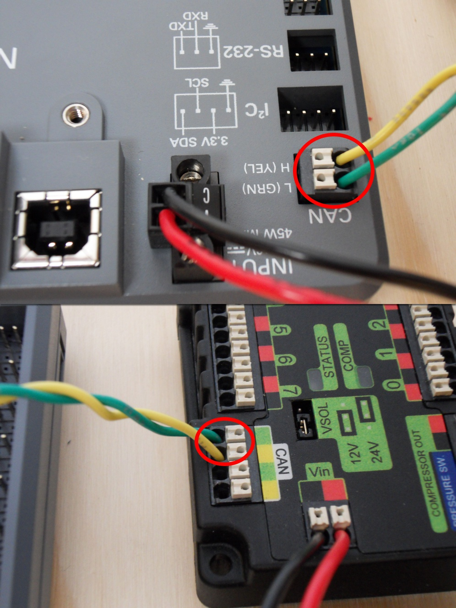
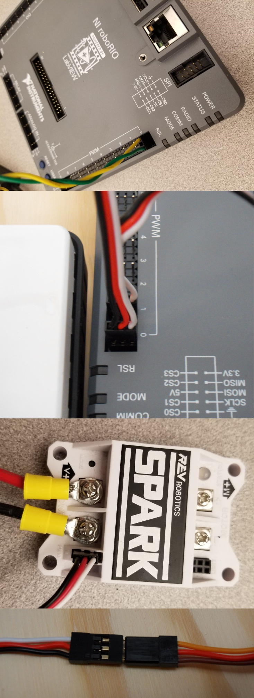
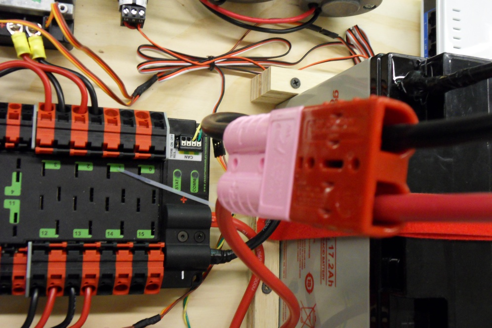

How to Wire an FRC Robot
========================

.. note::

   Este documento descreve como fazer o cabeamento de uma chapa com componentes eletrônicos para testes.

   Algumas das imagens presentes nessa seção demonstram o Setup do sistema de controle de um robô que utiliza controladores de motor Spark. Os diagramas e layouts do cabeamento a seguir são bem parecidos com o dos demais controladores. Há também um segundo set de imagens que demonstram o passo a passo do cabeamento de controladores PWM com fios integrados.

Gather Materials
----------------

.. image:: images/how-to-wire-a-robot/image0.jpg
   :width: 600

Encontre os seguintes componentes eletrônicos e ferramentas

- Kit Materials:

      - Power Distribution Panel (PDP)
      - roboRIO
      - Pneumatics Control Module (PCM)
      - Voltage Regulator Module (VRM)
      - OpenMesh radio (with power cable and Ethernet cable)
      - Robot Signal Light (RSL)
      - 4x Victor SPX or other speed controllers
      - 2x PWM y-cables
      - 120A Circuit breaker
      - 4x 40A Circuit breaker
      - 6 AWG Red wire
      - 10 AWG Red/Black wire
      - 18 AWG Red/Black wire
      - 22AWG yellow/green twisted CAN cable
      - 16x 10-12 AWG  (yellow) ring terminals
        (8x quick disconnect pairs if using integrated wire controllers)
      - 2x Andersen SB50 battery connectors
      - 6AWG Terminal lugs
      - 12V Battery
      - Red/Black Electrical tape
      - Dual Lock material or fasteners
      - Zip ties
      - 1/4" or 1/2" plywood

- Tools Required:

      - Wago Tool or small flat-head screwdriver
      - Very small flat head screwdriver (eyeglass repair size)
      - Philips head screw driver
      - 5mm Hex key (3/16" may work if metric is unavailable)
      - 1/16" Hex key
      - Wire cutters, strippers, and crimpers
      - 7/16” box end wrench or nut driver

Produza a base do para o Sistema de Controle
--------------------------------------------

Para a produção da base, corte uma chapa (madeira ou plástico) de 1/4” ou 1/2" de espessura e aproximadamente 24" x 16". Se for o caso de um Robot Quick Build, consulte a documentação e verifique o tamanho ideal para a configuração do chassi correspondente.

Organize os principais componentes do Sistema de Controle
---------------------------------------------------------

.. image:: images/how-to-wire-a-robot/image1.jpg
   :width: 600

Organize os componentes na chapa. O layout da imagem acima (images/how-to-wire-a-robot) é um bom exemplo.

.. image:: images/how-to-wire-a-robot/image2.png
   :width: 600

Prenda os componentes
---------------------

Utilizando Dual Lock (tipo de velcro), fitas dupla-face (VHB por exemplo) ou ZIP ties, prenda todos componentes à base. Tenha em mente que, em muitos dos jogos da FRC, há constante toque físico entre os robôs, sendo a Dual Lock uma opção que pode ser utilizada, mas não sozinha. Muitos times optam por utilizar fitas dupla face e, principalmente, ZIP ties, mesmo sem Dual Lock.

Attach Battery Connector to PDP
Prenda o Battery Conector  à PDP
-------------------------------

.. image:: images/how-to-wire-a-robot/image3.jpg
   :width: 600

Requer: Battery Connector, 6AWG terminal lugs, 1/16" Allen, 5mm Allen,
7/16" Box end

Prenda os "terminal lugs" ao battery conector (Conector da bateria):

1. Utilizando uma 1/16" Allen wrench, retire os dois parafusos que prendem a proteção dos terminais da PDP.
2. Utilizando uma 5mm Allen wrench (3/16" também funciona se não tiver em mm), remova o parafuso e a arruela que que fica rosqueadas ao o polo negativo da PDP e prenda o terminal negativo do battery conector (conector da bateria).
3. Utilizando um 7/16" box end wrench, remova a proteção de borracha e a porca do "parafuso" do main breaker, encaixe o terminal positivo do conector do battery conector (conector de bateria) e prenda-o bem com a porca.

Conecte o Breaker à PDP
-----------------------

.. image:: images/how-to-wire-a-robot/image4.jpg
   :width: 600

Requer: 6AWG red wire, 2x 6AWG terminal lugs, 5mm Allen, 7/16" box end

Secure one terminal lug to the end of the 6AWG red wire. Using the 7/16"
box end, remove the nut from the “AUX” side of the 120A main breaker and
place the terminal over the stud. Loosely secure the nut (you may wish
to remove it shortly to cut, strip, and crimp the other end of the
wire). Measure out the length of wire required to reach the positive
terminal of the PDP.
Prenda um terminal olho na ponta do fio vermelho 6AWG. Retire a porca rosqueada ao parafuso do lado "AUX" do main breaker, encaixe o terminal do cabo no parafuso e rosqueie a porca, prendendo-o.

1. Corte, encaixa e crimpe o terminal ao "2nd end" do fio vermelho 6AWG.
2. Utilizando o 7/16" box end, prenda o fio ao lado "AUX" do main breaker de 120A.
3. Utilizando a Allen de 5mm, prenda a outra ponta ao teminal positivo da PDP.

Insulate PDP connections
Isole as conexões da PDP
------------------------

.. image:: images/how-to-wire-a-robot/image5.jpg
   :width: 600

Requer: 1/16" Allen, Electrical tape (Fita isolante)

1. Utilizando a fita isolante, isole as duas conexões do main breaker. Isole a parte dos terminais da PDPD que irão entrar em contato com a proteção quando for presa novamente. Uma maneira de isolar as conexões do main breaker é passar a fita no cabo e na porca antes de serem presos e, depois de presos, passar fita novamente.
2. Utilizando a Allen de 1/16", prenda a proteção dos terminais à PDP.

Conectores Wago
---------------

.. raw:: html

    

        <iframe src="//www.youtube.com/embed/L3GJGQ7mJqk" frameborder="0" allowfullscreen style="position: absolute; top: 0; left: 0; width: 100%; height: 100%;"></iframe>
    

O próximo passo é aprender a utilizar os conectores Wago da PDP. Para utiliza-los, pegue uma pequena chave de fenda e a insira no buraco retangular ( na lateral da PDP) o mais horizontal possível. Empurre a chave para cima, aí você vai poder ver que, abaixo do buraco retangular, uma pequena entrada vai se abrir. Nessa entrada devem ser presos os cabos dos controladores. A PDP têm dois tipos de conectores:

- Small Wago connector: Aceita 10AWG-24AWG, strip 11-12mm (~7/16")
- Large Wago connector: Aceita 6AWG-12AWG, strip 12-13mm(~1/2")

Para facilitar a entrada do cabo na entrada da PDP, deve deixar a parte de cobre exposta bem "esticada" (não torcida, de preferencia).

Energizando controlador de motor
--------------------------------

.. image:: images/how-to-wire-a-robot/image6.jpg
   :width: 600
.. image:: images/how-to-wire-a-robot/image7.jpg
   :width: 600

Requer: Wire Stripper, Small Flat Screwdriver, 10 or 12 AWG wire, 10
or 12 AWG fork/ring terminals (terminal controllers only), wire crimper

Para Victor SPX ou outro controlador de motor com fios integrados (imagem de cima):
- Desencape a ponta dos cabos de energia (vermelho e preto) e insira na entrada (conector Wago) de 40 amperes (a maior) da PDP.

Para controladores de motor com terminais (imagem de baixo)

1. Corte um cabo vermelho e um cabo preto do tamanho apropriado para chegar até a entrada de 40 amperes da PDP (é recomendado que seja um pouco maior do que o necessário);
2. Insira a parte desencapada dos fios na PDP conforme a polaridade correspondente;
3. Crimpe um terminal olho ou "fork" na outra ponta do cabo;
4. Prenda os fios nos terminais nos controladores (vermelho no + e preto no -).

Weidmuller Connectors
---------------------

.. raw:: html

    

        <iframe src="//www.youtube.com/embed/kCcDw3lDYis" frameborder="0" allowfullscreen style="position: absolute; top: 0; left: 0; width: 100%; height: 100%;"></iframe>
    

The correct strip length is ~5/16" (8mm), not the 5/8" mentioned in the
video.

A number of the CAN and power connectors in the system use a Weidmuller
LSF series wire-to-board connector. There are a few things to keep in
mind when using this connector for best results:

- Wire should be 16AWG to 24AWG (consult rules to verify required gauge for power wiring)
- Wire ends should be stripped approximately 5/16"
- To insert or remove the wire, press down on the corresponding "button" to open the terminal

After making the connection check to be sure that it is clean and
secure:

- Verify that there are no "whiskers" outside the connector that may cause a short circuit
- Tug on the wire to verify that it is seated fully. If the wire comes out and is the correct gauge it needs to be inserted further and/or stripped back further.

roboRIO Power
-------------

.. image:: images/how-to-wire-a-robot/image8.jpg
   :width: 600

Requires: 10A/20A mini fuses, Wire stripper, very small flat
screwdriver, 18AWG Red and Black

1. Insert the 10A and 20A mini fuses in the PDP in the locations shown on the silk screen (and in the image above)
2. Strip ~5/16" on both the red and black 18AWG wire and connect to the "Vbat Controller PWR" terminals on the PDB
3. Measure the required length to reach the power input on the roboRIO. Take care to leave enough length to route the wires around any other components such as the battery and to allow for any strain relief or cable management.
4. Cut and strip the wire.
5. Using a very small flat screwdriver connect the wires to the power input connector of the roboRIO (red to V, black to C). Also make sure that the power connector is screwed down securely to the roboRIO.

Energizando Voltage Regulator Module (VRM)
------------------------------------------

.. image:: images/how-to-wire-a-robot/image11.jpg
   :width: 600

Requires: Wire stripper, small flat screwdriver (optional), 18AWG red
and black wire:

1. Strip ~5/16" on the end of the red and black 18AWG wire.
2. Connect the wire to one of the two terminal pairs labeled "Vbat VRM PCM PWR" on the PDP.
3. Measure the length required to reach the "12Vin" terminals on the VRM. Take care to leave enough length to route the wires around any other components such as the battery and to allow for any strain relief or cable management.
4. Cut and strip ~5/16" from the end of the wire.
5. Connect the wire to the VRM 12Vin terminals.

Pneumatics Control Module Power (Optional)
------------------------------------------

.. image:: images/how-to-wire-a-robot/image12.jpg
   :width: 600

Requires: Wire stripper, small flat screwdriver (optional), 18AWG red
and black wire

Note: The PCM is an optional component used for controlling pneumatics
on the robot.

1. Strip ~5/16" on the end of the red and black 18AWG wire.
2. Connect the wire to one of the two terminal pairs labeled "Vbat VRM PCM PWR" on the PDP.
3. Measure the length required to reach the "Vin" terminals on the PCM. Take care to leave enough length to route the wires around any other components such as the battery and to allow for any strain relief or cable management.
4. Cut and strip ~5/16" from the end of the wire.
5. Connect the wire to the PCM 12Vin terminals.

Ethernet e energia do rádio
---------------------------

.. warning:: NÃO conecte o POE diretamente ao RoboRIO. Você deve utilizar um CABO ETHERNET que faça a ponte entre o POE e o RoboRIO.

.. image:: images/how-to-wire-a-robot/image13.jpg
   :width: 600

Requer: Small flat screwdriver (optional), Rev radio PoE cable

2. Insira os conectores do PoE nos terminais correspondentes à 12V/2A da VRM.
2. Conecte o conector macho de Ethernet (RJ45) à porta de ethernet do rádio mais próxima da entrada do pino de energia (com o nome de 18-24v POE).

roboRIO to Radio Ethernet
-------------------------

.. image:: images/how-to-wire-a-robot/image14.jpg
   :width: 600

Requires: Ethernet cable

Connect an Ethernet cable from the female RJ45 (Ethernet) port of the
Rev Passive POE cable to the RJ45 (Ethernet) port on the roboRIO.

CAN Devices
-----------

roboRIO to PCM CAN
~~~~~~~~~~~~~~~~~~

Requires: Wire stripper, small flat screwdriver (optional), yellow/green
twisted CAN cable

Note: The PCM is an optional component used for controlling pneumatics
on the robot. If you are not using the PCM, wire the CAN connection
directly from the roboRIO (shown in this step) to the PDP (show in the
next step).

1. Strip ~5/16" off of each of the CAN wires.
2. Insert the wires into the appropriate CAN terminals on the roboRIO (Yellow->YEL, Green->GRN).
3. Measure the length required to reach the CAN terminals of the PCM (either of the two available pairs). Cut and strip ~5/16" off this end of the wires.
4. Insert the wires into the appropriate color coded CAN terminals on the PCM. You may use either of the Yellow/Green terminal pairs on the PCM, there is no defined in or out.

CAN da PCM para a PDP
~~~~~~~~~~~~~~~~~~~~~

.. image:: images/how-to-wire-a-robot/image16.jpg
   :width: 600

Requer: Wire stripper, small flat screwdriver (optional), yellow/green
twisted CAN cable

Note:  A PCM é um compinente opcional, utilizado para controlar os sistemas pneumáticos do robô. Se não estiver utilizando uma PCM, conecte os fios CAN que vem do RoboRIO diretamente na PDP.

1. Insira os fios nos terminais CAN da PCM
2. Messa o comprimento dos fios para que consigam chegar até a PDP (cada um deles).
3. Insira os fios nos terminais CAN da PDP. Pode usar qualquer um dos dois pares da entrada.

  Note: Utilize a PDP como o último componente da linha CAN (CAN bus)

Cabos PWM
----------

Requer: 4x PWM cables (if using non-integrated wire controllers), 2x
PWM Y-cable (Optional)

Opção 1 (conectar diretamente):

- Conecte os cabos PWM de cada controlador diretamente no RoboRIO. Para o Victor SPX e outros controladores PWM/CAN, o fio verde (fio preto para controladores com fios não integrados) deve estar conectado na parte mais próxima da borda do RoboRIO. Para controladores com fios não integrados, tenha certeza de que o fio preto esteja conectado conforme o controlador indica. é recomendado conectar o lado esquerdo às entradas PWM 0 e 1 e o lado direito nas entradas PWM 2 e 3 para ajudar na organização durante a programação, mas fique atento: todas as entradas devem estar de acordo com o controlador que lhes foi designado.

Option 2 (Y-cable):
Opção 2 (cabo Y)

1. Conecte 1 cabo PWM Y aos cabos PWM dos contoladores que controlam um lado do robô. O fio marrom do cabo Y deve corresponder ao fio verde/preto do cabo PWM do controlador.
2. Connect the PWM Y-cables to the PWM ports on the roboRIO. The brown wire should be towards the outside of the roboRIO. It is recommended to connect the left side to PWM 0 and the right side to PWM 1 for the most straightforward programming experience, but any channel will work as long as you note which side goes to which channel and adjust the code accordingly.
2. Conecte os cabos PMW Y às portas PWM do RoboRIO. O fio marrom deve ser conectado ao lado mais próximo à borda do RoboRIO. É recomendado que se conecte o lado esquerdo ao PWM 0 e o lado direito ao PWM 1 para ajudar na organização durante a programação, mas fique atento: As entradas devem estar de acordo com o lado do robô que lhes fora designado.

Robot Signal Light (RSL)
------------------------

.. image:: images/how-to-wire-a-robot/image18.jpg
   :width: 600

Requer: Wire stripper, 2 pin cable, Robot Signal Light, 18AWG red
wire, very small flat screwdriver

1. Desencape a ponta de um cabo preto e um cabo vermelho e prenda um conector tubular em cada;
2. Insira o cabo preto no terminal do centro (N), e prenda-o ("aperte" o parafuso do terminal);
3. Corte um pequeno cabo vermelho 18AWG, insira uma das pontas no terminal "La" e prenda-o, insira a outra ponta no terminal "Lb", mas ainda não prenda;
4. Insira o cabo vermelho com o conector tubular no terminal "Lb", junto com o cabo vermelho pequeno e prenda-os;
5. Conecte os cabos com conector tubular na porta RSL do RoboRIO. O fio preto deve ser conectado à porta mais próxima da borda do RoboRIO.

Você deve prender (temporariamente) a RSL à chapa/base utilizando zip ties ou Dual Shock (é muito importante que a RSL esteja presa em um local bem visível do robô).

Circuit Breakers / Fusíveis
----------------

.. image:: images/how-to-wire-a-robot/image19.jpg
   :width: 600

Requer: 4x 40A circuit breakers (fusível de 40 amperes)

Adicione um fusível de 40 amperes na posição correspondente onde os cabos do controlador estão conectados à PDP. Observe que as frestas para encaixar o fusível sempre estão ao lado da entrada positiva correspondente. Todos os terminais negativos estão conectados internamente..

Se estiver trabalhando em um Robot Quick Build, coloque a chapa/base dentro do chassi antes de continuar.

Motor Power
Energizando motor
-----------

.. image:: images/how-to-wire-a-robot/image20.jpg
   :width: 600

Requer: Wire stripper, wire crimper, phillips head screwdriver, wire
connecting hardware

Para cada CIM motor:

- Estique os fios vermelhos e pretos de cada motor CIM

Para controladores com fios integrados (incluindo Victor SPX):

1. Deixe os cabos brancos e vermelhos do controlador esticados.
2. Conecte os fios do motor nos fios output/saída do controlador (é recomendado que conecte o fio vermelho ao fio branco M+). A imagem abaixo mostra exemplos de utilização dos quick disconnect terminal.

Para Sparks e outros controladores com fios não integrados:

1. Crimpe um terminal "olho" ou "fork" em cada um dos fios (tanto dos motores quanto controladores).
2. Conecte os fios no output/saída de cada controlador de motor (vermelho no positivo, preto no negativo).

STOP
----

.. image:: images/how-to-wire-a-robot/image21.png
   :width: 600

.. danger:: STOP!!

.. danger:: Before plugging in the battery, make sure all connections have been made with the proper polarity. Ideally have someone that did not wire the robot check to make sure all connections are correct.

Antes de conectar a bateria, tenha certeza que todas as conexões estão com as polaridades corretas (positivo no positivo, negativo no negativo). Provavelmente devem ter algumas que não estão conectadas, cheque tudo.

- Verifique se o fio vermelho está conectado ao terminal positivo da bateria.
- Verifique se o fio vermelho está indo do main breaker para o terminal positivo da PDP e se o fio preto está indo para o terminal negativo.
- Para cada controlador de motor, verifique se o fio vermelho que sai do terminal vermelho da PDP está conectado com o fio vermelho do Victor SPX (não o M+ branco!!!!)
- Para cada componente que está ligado à PDP, verifique se o fio vermelho que sai do terminal vermelho da PDP se conecta com o terminal positivo do componente.
- Tenha certeza de que o conector PoE está conectado diretamente ao rádio, NÃO AO RoboRIO! Para conectar no RoboRIO, deve ser utilizado um cabo Ethernet adicional.

É recomendado que o robô esteja com as rodas suspensas para prevenir acidentes se o robô se movimentar de maneira inesperada.

Manage Wires
Organize os fios
------------

Requer: Zip ties

Essa é a hora de adicionar alguns zip ties aos fios. Isso fará com que os fios do robô se mantenham firmes e organizados.

Conecte a bateria ao robô como o conector Anderson. Para ligar o robô, empurre a "alavanca" do main breaker até ela dar um estalo e ficar presa. Se as os eletrônicos começarem a piscar, provavelmente está tudo certo. Agora conecte o RoboRIO ao computador e tente passar o código!
