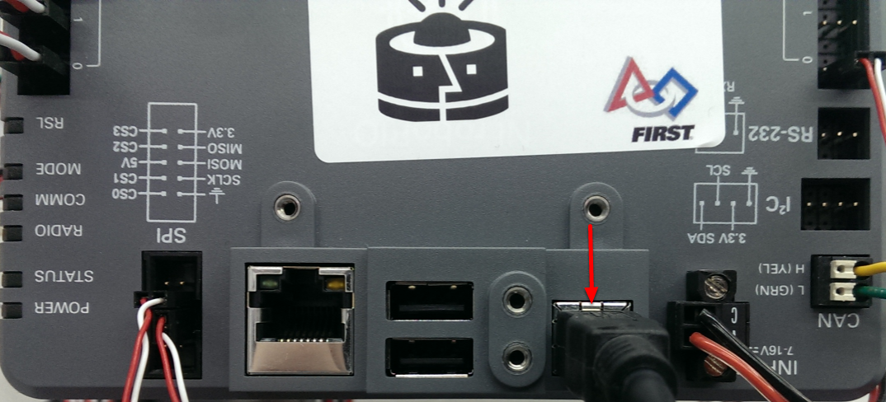
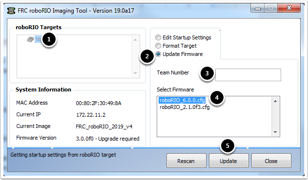
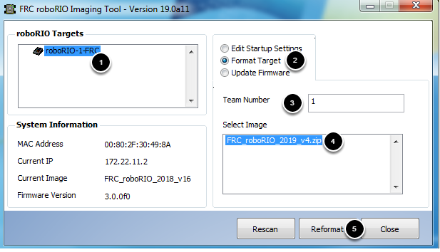
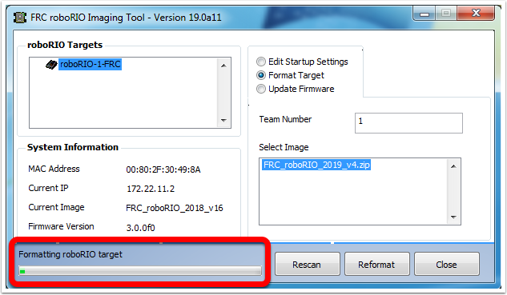

Formatando seu roboRIO
======================

.. warning:: Antes de criar imagens do seu roboRIO, você deve ter concluído a instalação do :doc:`Ferramentas de jogo FRC<frc-game-tools>`.  Você também deve ter a energia do roboRIO conectada corretamente ao painel de distribuição de energia. Verifique se os fios de energia do roboRIO estão seguros e se o conector está bem firme no roboRIO (4 parafusos no total para verificar).

Configurando o roboRIO
^^^^^^^^^^^^^^^^^^^^^^

A ferramenta de imagem roboRIO será usada para criar uma imagem do seu roboRIO com o software mais recente.

Conexão USB
~~~~~~~~~~~

Conecte um cabo USB da porta do dispositivo USB roboRIO ao PC. Isso requer um cabo USB tipo A macho (extremidade padrão do PC) para tipo B cabo macho (quadrado com 2 cantos cortados), mais comumente encontrado como cabo USB da impressora.

.. note:: O roboRIO só deve ser visualizado através da conexão USB. Não é recomendável tentar criar imagens usando a conexão Ethernet.

Instalação do Driver
~~~~~~~~~~~~~~~~~~~~

O Driver do dispositivo deve ser instalado automaticamente. Se você ver um pop-up "Dispositivo Novo" no canto inferior direito da tela, aguarde a instalação do driver antes de continuar.

Iniciando a ferramenta de imagem
^^^^^^^^^^^^^^^^^^^^^^^^^^^^^^^^

.. image:: images/imaging-your-roborio/launching-the-imaging-tool.png

A ferramenta de imagem roboRIO e a imagem mais recente são instaladas com as ferramentas do jogo FRC da NI. Inicie a ferramenta de criação de imagens clicando duas vezes no atalho na área de trabalho. Se você tiver dificuldades em criar imagens do seu roboRIO, pode ser necessário clicar com o botão direito do mouse no ícone e selecionar Executar como administrador.

.. note:: A ferramenta de criação de imagens roboRIO também está localizada ``C:\Program Files (x86)\National Instruments\LabVIEW YYYY\project\roboRIO Tool``onde YYYY é o ano atual - 1. Se for 2020, o diretório seria ``LabVIEW 2019``.

Ferramenta de imagem do roboRIO
^^^^^^^^^^^^^^^^^^^^^^^^^^^^^^^

.. image:: images/imaging-your-roborio/roborio-imaging-tool.png

Após do lançamento, a ferramenta de imagem roboRIO procurará os roboRIOs disponíveis e indicará qualquer um encontrado na caixa superior esquerda. A caixa inferior esquerda mostra informações e configurações do roboRIO selecionado atualmente. O painel direito contém controles para modificar as configurações do roboRIO:

- **Editar configurações de inicialização** - Esta opção é usada quando você deseja definir as configurações de inicialização do roboRIO (as configurações no painel direito), sem gerar imagens do roboRIO.
- **Formatar alvo** - Esta opção é usada quando você deseja carregar uma nova imagem no roboRIO (ou atualizar novamente a imagem existente). Essa é a opção mais comum.
- **Atualizar Firmware** - Esta opção é usada para atualizar o firmware do roboRIO. Para esta temporada, a ferramenta de criação de imagens exigirá que o firmware do roboRIO seja da versão 5.0 ou superior.

Atualização do Firmware
~~~~~~~~~~~~~~~~~~~~~~~

O firmware do roboRIO deve ter pelo menos a versão 5.0 para funcionar com a imagem de 2019. Se o seu roboRIO tiver pelo menos a versão 5.0 (como mostrado na parte inferior esquerda da ferramenta de criação de imagens), você não precisará atualizar.

Para atualizar o firmware do roboRIO:

1. Verifique se o seu roboRIO está selecionado no painel superior esquerdo.
2. Selecione atualizar firmware no painel superior direito.
3. Digite um número de equipe na caixa Número da equipe.
4. Selecione o arquivo firmware mais recente no canto inferior direito.
5. Clique no botão **atualizar**.

Visualizando o roboRIO
^^^^^^^^^^^^^^^^^^^^^^

1. Verifique se o roboRIO está selecionado no painel superior esquerdo.
2. Selecione formatar alvo no painel direito.
3. Digite o número da sua equipe na caixa.
4. Selecione a versão mais recente da imagem na caixa.
5. Clique em reformatar para iniciar o processo de visualização da imagem.

Progresso de visualização da imagem
^^^^^^^^^^^^^^^^^^^^^^^^^^^^^^^^^^^

O processo de visualização da imagem levará aproximadamente de 3 a 10 minutos. Uma barra de progresso no canto inferior esquerdo da janela indicará o progresso.

Visualização completa
^^^^^^^^^^^^^^^^^^^^^

.. image:: images/imaging-your-roborio/imaging-complete.png

Quando a imagem for concluída, você deverá ver a caixa de diálogo acima. Clique em Ok e clique no botão Fechar no canto inferior direito para fechar a ferramenta de criação de imagens. Reinicie o roboRIO usando o botão Redefinir para que o novo número da equipe entre em vigor.

.. note:: A funcionalidade padrão de webdash CAN foi removida da imagem (os dispositivos CAN ainda funcionarão com o código do robô). Você precisará usar as ferramentas fornecidas por fornecedores individuais para atender seus dispositivos CAN.

Solução de problemas
^^^^^^^^^^^^^^^^^^^^

Se você não conseguir criar uma imagem do seu roboRIO, as etapas de solução de problemas incluem:

- Tente executar a ferramenta de imagem roboRIO como administrador clicando com o botão direito do mouse no ícone da área de trabalho para iniciá-la.
- Tente acessar a página do roboRIO com um navegador da web em ``http://172.22.11.2/`` e / ou verifique se o adaptador de rede da NI aparece na sua lista de adaptadores de rede no painel de controle. Caso contrário, tente reinstalar o NI FRC Game Tools ou tente um PC diferente.
- Verifique se o seu firewall está desligado.
- Experimente um PC diferente.
- Algumas equipes enfrentam um problema em que a criação de imagens falha se o nome do dispositivo do computador que você está usando tiver um traço (`` -``). Tente renomear o computador (ou usando um PC diferente).
- Tente inicializar o roboRIO no modo de segurança pressionando e segurando o botão de reset por pelo menos 5 segundos.
