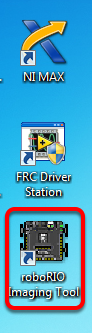

Imaginando seu roboRIO
======================

.. warning:: Antes de criar imagens do seu roboRIO, você deve ter concluído a instalação do :doc:`Ferramentas de jogo FRC<frc-game-tools>`.  Você também deve ter a energia do roboRIO conectada corretamente ao painel de distribuição de energia. Verifique se os fios de energia do roboRIO estão seguros e se o conector está bem firme no roboRIO (4 parafusos no total para verificar).

Configurando o roboRIO
^^^^^^^^^^^^^^^^^^^^^^

A ferramenta de imagem roboRIO será usada para criar uma imagem do seu roboRIO com o software mais recente.

Conexão USB
~~~~~~~~~~~

.. image:: images/imaging-your-roborio/usb-connection.png

Conecte um cabo USB da porta do dispositivo USB roboRIO ao PC. Isso requer um cabo USB tipo A macho (extremidade padrão do PC) para tipo B cabo macho (quadrado com 2 cantos cortados), mais comumente encontrado como cabo USB da impressora.

.. note:: O roboRIO só deve ser visualizado através da conexão USB. Não é recomendável tentar criar imagens usando a conexão Ethernet.

Instalação do Driver
~~~~~~~~~~~~~~~~~~~~

O Driver do dispositivo deve ser instalado automaticamente. Se você ver um pop-up "Dispositivo Novo" no canto inferior direito da tela, aguarde a instalação do driver antes de continuar.

Iniciando a ferramenta de imagem
^^^^^^^^^^^^^^^^^^^^^^^^^^^^^^^^

A ferramenta de imagem roboRIO e a imagem mais recente são instaladas com as ferramentas do jogo FRC da NI. Inicie a ferramenta de criação de imagens clicando duas vezes no atalho na área de trabalho. Se você tiver dificuldades em criar imagens do seu roboRIO, pode ser necessário clicar com o botão direito do mouse no ícone e selecionar Executar como administrador.

.. note:: A ferramenta de criação de imagens roboRIO também está localizada ``C:\Program Files (x86)\National Instruments\LabVIEW YYYY\project\roboRIO Tool``onde YYYY é o ano atual - 1. Se for 2020, o diretório seria ``LabVIEW 2019``.

Ferramenta de imagem do roboRIO
^^^^^^^^^^^^^^^^^^^^^^^^^^^^^^^

.. image:: images/imaging-your-roborio/roborio-imaging-tool.png

Após do lançamento, a ferramenta de imagem roboRIO procurará os roboRIOs disponíveis e indicará qualquer um encontrado na caixa superior esquerda. A caixa inferior esquerda mostra informações e configurações do roboRIO selecionado atualmente. O painel direito contém controles para modificar as configurações do roboRIO:

- **Editar configurações de inicialização** - Esta opção é usada quando você deseja definir as configurações de inicialização do roboRIO (as configurações no painel direito), sem gerar imagens do roboRIO.
- **Formatar alvo** - Esta opção é usada quando você deseja carregar uma nova imagem no roboRIO (ou atualizar novamente a imagem existente). Essa é a opção mais comum.
- **Atualizar Firmware** - Esta opção é usada para atualizar o firmware do roboRIO. Para esta temporada, a ferramenta de criação de imagens exigirá que o firmware do roboRIO seja da versão 5.0 ou superior.

Atualização do Firmware
~~~~~~~~~~~~~~~~~~~~~~~

.. image:: images/imaging-your-roborio/updating-firmware.png

O firmware do roboRIO deve ter pelo menos a versão 5.0 para funcionar com a imagem de 2019. Se o seu roboRIO tiver pelo menos a versão 5.0 (como mostrado na parte inferior esquerda da ferramenta de criação de imagens), você não precisará atualizar.

To update roboRIO firmware:

1. Make sure your roboRIO is selected in the top left pane.
2. Select Update Firmware in the top right pane
3. Enter a team number in the Team Number box
4. Select the latest firmware file in the bottom right
5. Click the **Update** button

Imaging the roboRIO
^^^^^^^^^^^^^^^^^^^

.. image:: images/imaging-your-roborio/imaging-the-roborio.png

1. Make sure the roboRIO is selected in the top left pane
2. Select Format Target in the right pane
3. Enter your team number in the box
4. Select the latest image version in the box.
5. Click Reformat to begin the imaging process.

Imaging Progress
^^^^^^^^^^^^^^^^

.. image:: images/imaging-your-roborio/imaging-progress.png

The imaging process will take approximately 3-10 minutes. A progress bar in the bottom left of the window will indicate progress.

Imaging Complete
^^^^^^^^^^^^^^^^

.. image:: images/imaging-your-roborio/imaging-complete.png

When the imaging completes you should see the dialog above. Click Ok, then click the Close button at the bottom right to close the imaging tool. Reboot the roboRIO using the Reset button to have the new team number take effect.

.. note:: The default CAN webdash functionality has been removed from the image (CAN devices will still work from robot code). You will need to use the tools provided by individual vendors to service their CAN devices.

Troubleshooting
^^^^^^^^^^^^^^^

If you are unable to image your roboRIO, troubleshooting steps include:

- Try running the roboRIO Imaging Tool as Administrator by right-clicking on the Desktop icon to launch it.
- Try accessing the roboRIO webpage with a web-browser at ``http://172.22.11.2/`` and/or verify that the NI network adapter appears in your list of Network Adapters in the Control Panel. If not, try re-installing the NI FRC Game Tools or try a different PC.
- Make sure your firewall is turned off.
- Try a different PC
- Some teams have experienced an issue where imaging fails if the device name of the computer you're using has a dash (``-``) in it. Try renaming the computer (or using a different PC).
- Try booting the roboRIO into Safe Mode by pressing and holding the reset button for at least 5 seconds.
