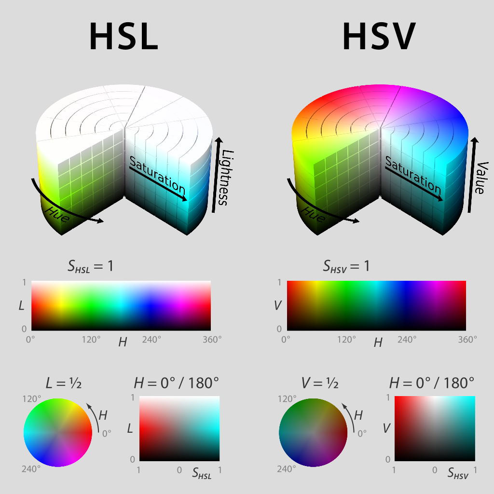

LEDs
====
Os LEDs são comumente usados pelas equipes há vários anos por vários motivos. Eles permitem que as equipes depurem a funcionalidade do robô do público, forneçam um marcador visual para o robô e podem simplesmente adicionar algum apelo visual. O WPILib possui uma API para controlar os LEDs WS2812 com seus pinos de dados conectados via PWM.

Referenciando os LEDs
---------------------

Você, primeiramente, cria um ``AddressableLED`` objeto que usa a porta PWM como argumento. Ele *must* ser um cabeçalho PWM no roboRIO. Depois, você define o número de LEDs localizados na sua faixa de LEDs, o que pode ser feito com a ``setLength()`` função.

.. important:: É importante notar que definir o comprimento do cabeçalho LED é uma tarefa cara e ele não recomendado para executar este periodicamente.

Depois que o comprimento da faixa for definido, você precisará criar um ``AddressableLEDBuffer`` objeto que recebe o número de LEDs como entrada. Você ligará ``myAddressableLed.setData(myAddressableLEDBuffer)`` para definir os dados de saída do led. Finalmente, você pode ligar to set the led output data ``myAddressableLed.start()`` para escrever a saída continuamente. Abaixo está um exemplo completo do processo de inicialização.

.. note:: C++ não possui um AddressableLEDBuffer, e usa um Array.

Definindo a faixa para uma cor
------------------------------

A cor pode ser definida como um led individual na faixa usando dois métodos: `` setRGB``, que aceita valores RGB como entrada e ``setHSV()`` na qual aceita valores HSV como entrada.

Usando valores RGB
^^^^^^^^^^^^^^^^^^

RGB significa vermelho, verde e azul. Este é um modelo de cores bastante comum, pois é bastante fácil de entender. Os LEDs podem ser configurados com o ``setRGB`` um método que leva 4 argumentos: índice do LED, quantidade de vermelho, quantidade de verde, quantidade de azul. A quantidade de vermelho, verde e azul são valores inteiros entre 0 e 255.

Usando valores HSV
^^^^^^^^^^^^^^^^^^

HSV significa Matiz, Saturação e Valor. Matiz descreve a cor ou matiz, saturação sendo a quantidade de cinza e valor sendo o brilho. No WPILib, Hue é um número inteiro de 0 a 180. Saturação e Valor são números inteiros de 0 a 255. Se você observar um seletor de cores como `Google's <https://www.google.com/search?q=color+picker>`_, a matiz será de 0 a 360 e a saturação e o valor variam de 0% a 100%. É da mesma maneira que o OpenCV lida com cores HSV. Verifique se os valores HSV inseridos no WPILib estão corretos ou se a cor produzida pode não ser a mesma esperada.

Os LEDs podem ser configurados com o``setHSV`` método que utiliza 4 argumentos: índice do LED, matiz, saturação e valor. Um exemplo é mostrado abaixo para definir a cor de uma faixa de LED para vermelho (matiz de 0).

Criando um efeito arco-íris
---------------------------
O método abaixo faz algumas coisas importantes. Dentro do loop *for*, distribui igualmente o matiz por todo o comprimento do fio e armazena o matiz de LED individual em uma variável chamada ``hue``. Em seguida, o loop for define o valor HSV desse pixel especificado usando o valor ``hue``.

Movendo-se para fora do loop for, o ``m_rainbowFirstPixelHue`` itera o pixel que contém o matiz "inicial", criando o efeito arco-íris. ``m_rainbowFirstPixelHue`` para verifica se a matiz está dentro dos limites da matiz de 180. Isso ocorre porque a matiz HSV é um valor de 0 a 180.

.. note:: É uma boa prática de robô manter o ``robotPeriodic()`` método o mais limpo possível, por isso, criaremos um método para lidar com a configuração de nossos dados de LED. Poderemos ligar o método ``rainbow()`` e ligar para ``robotPeriodic()``.

Agora que tem-se o nosso ``rainbow`` método criado, vamos ter que, na realidade, ligar o método e definar os dados do LED.
