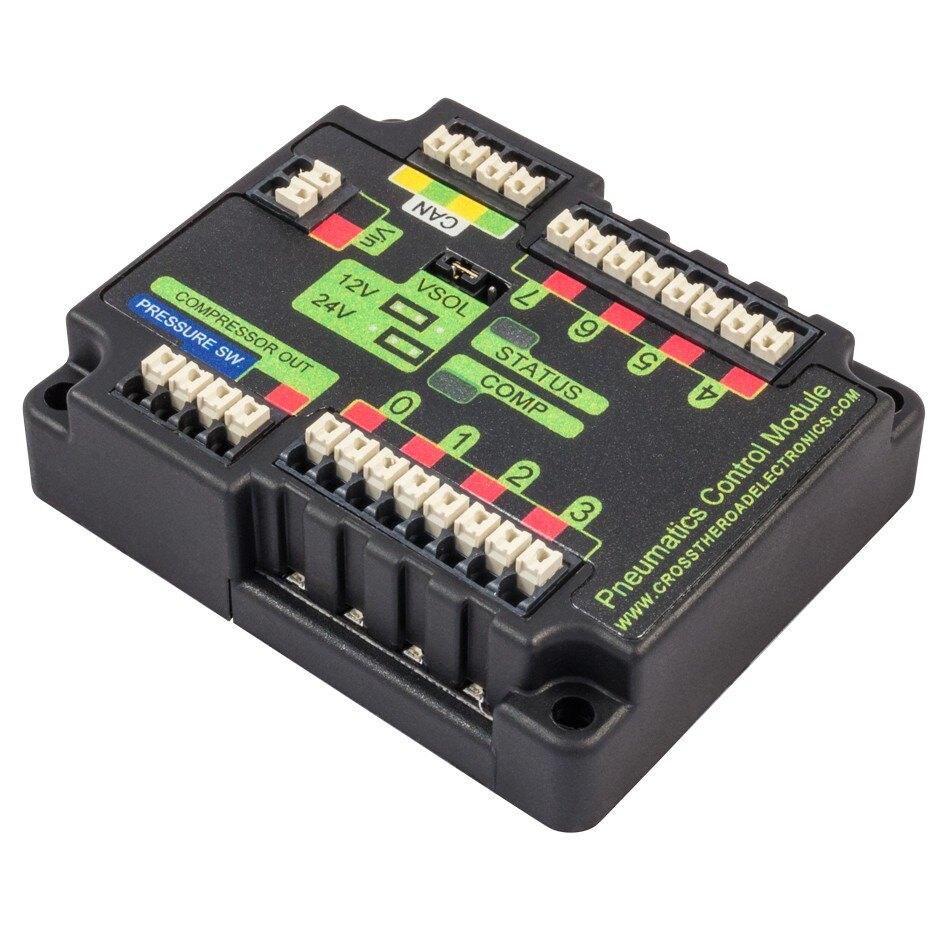

Operando cilindros pneumáticos
==============================

Usando o sistema de controle da FRC para controlar a pneumática
---------------------------------------------------------------
.. note:: Pneumatics Control Module (PCM) é a um dispositivo que utiliza a comunicação CAN que tem controle total do compressor  e até 8 módulos solenóides . A PCM é integrada em WPILib através de uma série de classes que simplificam o uso. O controle de circuito fechado do compressor e pressão é tratado pelo hardware da PCM e dos solenóides são manipulados pela Solenóide atualizada, que agora, controla os canais do solenóide na PCM. Além disso, um módulo PCM pode ser usado onde os módulo correspondentes aos solenóides são diferenciados pelo número do módulo nos construtores das classes de Solenóide e Compressor.

O Módulo de Controle Pneumático da CTR Electronics é responsável por regular a pressão
do robô usando um switch de pressão e um compressor e ligando e desligando os solenóides.
A PCM se comunica com o roboRIO através do CAN. Para obter mais informações, consulte a
Visão geral do hardware do sistema de controle FRC.

Números de módulos PCM
----------------------
Os módulos da PCM são identificados pelo seus Node ID. O padrão Node ID para
PCMs é 0. Se estiver usando um único PCM na linha CAN é recomendado deixá-lo
no padrão Node ID.

Gerando e armazenando pressão
-----------------------------
Na FRC, a pressão é criada usando um compressor pneumático e armazenada em tanques pneumáticos.
O compressor não precisa necessariamente estar no robô, mas deve ser alimentado pela PCM
do robô. O modo de “Closed Loop” no compressor é ativado por padrão, e é ele não recomenda que
as equipes de alterar essa configuração. Quando o "closed loop control" está ativado, o PCM liga
automaticamente o compressor quando o switch pressão está fechado (abaixo do limiar de pressão) e o
desliga quando o switch pressão está aberto (~ 120PSI). Quando o "loop control" está
desativado, o compressor não liga. Usando um compressor, os usuários podem consultar o status
do compressor. O estado (atualmente ativado ou desativado), o estado do switch pressão e a
corrente do compressor podem ser consultados no objeto Compressor.

.. note:: A PCM da Cross the Road Electronics permite para integrar closed loop control do compressor. Criando qualquer instância de um objeto Solenóide ou Solenóide Duplo habilitará o controle Compressor no PCM correspondente. O objeto Compressor é necessário apenas se você desejar desativar o compressor ou consultar o status do compressor.

Solenoid control
----------------
FRC teams use solenoids to preform a variety of tasks, from shifting
gearboxes to operating robot mechanisms. A solenoid is a valve used to
electronically switch a pressurized air line "on" or "off". For more
information on solenoids, see `this wikipedia
article <https://en.wikipedia.org/wiki/Solenoid_valve>`__. Solenoids are
controlled by a robot's Pneumatics Control Module, or PCM, which is in
turn connected to the robot's roboRIO via CAN. The easiest way to see a
solenoid's state is via the small red LED (which indicates if the valve
is "on" or not), and solenoids can be manually actuated when un-powered
with the small button adjacent to the LED.

Single acting solenoids apply or vent pressure from a single output
port. They are typically used either when an external force will provide
the return action of the cylinder (spring, gravity, separate mechanism)
or in pairs to act as a double solenoid. A double solenoid switches air
flow between two output ports (many also have a center position where
neither output is vented or connected to the input). Double solenoid
valves are commonly used when you wish to control both the extend and
retract actions of a cylinder using air pressure. Double solenoid valves
have two electrical inputs which connect back to two separate channels
on the solenoid breakout.

PCM Modules are identified by their CAN Device ID. The default CAN ID
for PCMs is 0. If using a single PCM on the bus it is recommended to
leave it at the default CAN ID. This ID can be changed with the Phoenix
Tuner application, in addition to other debug information. Phoenix Tuner
can be downloaded `from GitHub.
<https://github.com/CrossTheRoadElec/Phoenix-Releases>`_ For more
information about setting PCM CAN IDs see Updating and Configuring
Pneumatics Control Module and Power Distribution Panel.

Single Solenoids in WPILib
--------------------------

Single solenoids in WPILib are controlled using the Solenoid class. To
construct a Solenoid object, simply pass the desired port number
(assumes CAN ID 0) or CAN ID and port number to the constructor. To
set the value of the solenoid call set(true) to enable or set(false) to
disable the solenoid output.

.. tabs::

    .. code-tab:: java

        Solenoid exampleSolenoid = new Solenoid(1);

        exampleSolenoid.set(true);
        exampleSolenoid.set(false);

    .. code-tab:: c++

        frc::Solenoid exampleSolenoid {1};

        exampleSolenoid.Set(true);
        exampleSolenoid.Set(false);

Double Solenoids in WPILib
--------------------------
Double solenoids are controlled by the DoubleSolenoid class in WPILib.
These are constructed similarly to the single solenoid but there are now
two port numbers to pass to the constructor, a forward channel (first)
and a reverse channel (second). The state of the valve can then be set
to kOff (neither output activated), kForward (forward channel enabled)
or kReverse (reverse channel enabled). Additionally, the PCM CAN ID can
be passed to the DoubleSolenoid if teams have a non-standard PCM CAN ID

.. tabs::

   .. code-tab:: java

        // Using "import static an.enum.or.constants.inner.class.*;" helps reduce verbosity
        // this replaces "DoubleSolenoid.Value.kForward" with just kForward
        // further reading is available at https://www.geeksforgeeks.org/static-import-java/
        import static edu.wpi.first.wpilibj.DoubleSolenoid.Value.*;

        DoubleSolenoid exampleDouble = new DoubleSolenoid(1, 2);
        DoubleSolenoid anotherDoubleSolenoid = new DoubleSolenoid(/* The PCM CAN ID */ 9, 4, 5);

        exampleDouble.set(kOff);
        exampleDouble.set(kForward);
        exampleDouble.set(kReverse);

   .. code-tab:: c++

        frc::DoubleSolenoid exampleDouble {1, 2};
        frc::DoubleSolenoid exampleDouble {/* The PCM CAN ID */ 9, 1, 2};

        exampleDouble.Set(frc::DoubleSolenoid::Value::kOff);
        exampleDouble.Set(frc::DoubleSolenoid::Value::kForward);
        exampleDouble.Set(frc::DoubleSolenoid::Value::kReverse);
