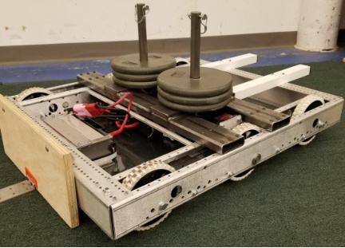
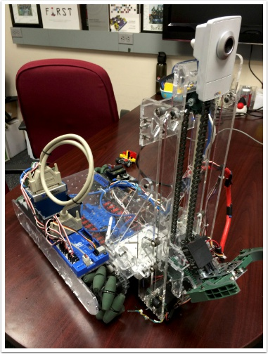
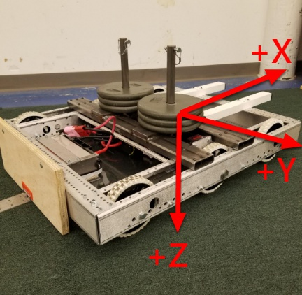

Usando WPILib para conduzir seu robô
====================================
O WPILib contém muitas explicações para ajudar seu robô a dirigir mais rápido.

Drivetrains padrão
------------------

Robôs de acionamento diferencial
^^^^^^^^^^^^^^^^^^^^^^^^^^^^^^^^

Essas bases de acionamento normalmente têm duas ou mais rodas on-line de tração ou omni por lado (por exemplo, 6WD ou 8WD) e também podem ser conhecidas como "skid-steer", "tank drive" ou "West Coast Drive". O sistema de transmissão do Kit de peças é um exemplo de acionamento diferencial. Essas unidades de transmissão são capazes de dirigir para frente / para trás e podem girar dirigindo os dois lados em direções opostas, fazendo com que as rodas deslizem para os lados. Essas unidades de transmissão não são capazes de movimento translacional lateral.

Mecanum Drive
^^^^^^^^^^^^^

Mecanum drive é um método de dirigir usando rodas especialmente projetadas que permitem ao robô dirigir em qualquer direção sem alterar a orientação do robô. Um robô com um sistema de transmissão convencional (todas as rodas apontando na mesma direção) deve girar na direção que precisa dirigir. Um robô mecanum pode se mover em qualquer direção sem primeiro girar e é chamado de acionamento holonômico. As rodas (mostradas neste robô) possuem roletes que fazem com que as forças de acionamento sejam aplicadas em um ângulo de 45 graus em vez de para a frente, como no caso de um acionamento convencional.

Quando vistos de cima, os roletes no trem de força mecanum devem formar um padrão 'X'. Isso resulta nos vetores de força (ao dirigir a roda para frente) nas duas rodas dianteiras apontando para frente e para dentro e as duas rodas traseiras apontando para frente e para fora. Girando as rodas em direções diferentes, vários componentes dos vetores de força são cancelados, resultando no movimento desejado do robô. Um gráfico rápido de diferentes movimentos foi fornecido abaixo, traçando os vetores de força para cada um desses movimentos, podendo ajudar a entender como essas unidades de transmissão funcionam. Ao variar as velocidades das rodas, além da direção, os movimentos podem ser combinados, resultando em translação em qualquer direção e rotação, simultaneamente.

Convenções de classe de unidade
-------------------------------
.. note:: Este artigo contém as convenções e padrões usados ​​pelas classes WPILib Drive (DifferentialDrive, MecanumDrive e KilloughDrive). Para mais detalhes sobre o uso dessas classes, consulte os artigos subseqüentes.

Inversão do motor
^^^^^^^^^^^^^^^^^
Por padrão, a classe inverte as saídas do motor para o lado direito do trem de força. Geralmente, isso significa que nenhuma inversão precisa ser feita nos objetos individuais do SpeedController. Para desativar esse comportamento, use o método setRightSideInverted ().

Squaring Inputs & Input Deadband
^^^^^^^^^^^^^^^^^^^^^^^^^^^^^^^^
Ao dirigir robôs, geralmente é desejável manipular as entradas do joystick, de modo que o robô tenha um controle mais preciso em baixas velocidades enquanto ainda usa toda a faixa de saída. Uma maneira de fazer isso é alinhar ao quadrado a entrada do joystick e reaplicar o sinal. Por padrão, a classe Differential Drive quadrará as entradas. Se isso não for desejado (por exemplo, se você passar valores de um PIDController), use um dos métodos de unidade com o parâmetro squaredInputs e defina-o como false.

Por padrão, a classe Unidade Diferencial aplica uma faixa morta de entrada de 0,02. Isso significa que os valores de entrada com magnitude abaixo de 0,02 (após qualquer quadrado como descrito acima) serão definidos como 0. Na maioria dos casos, essas pequenas entradas resultam da centralização imperfeita do joystick e não são suficientes para causar movimento do trem de força, a faixa morta ajuda a reduzir desnecessários aquecimento do motor que pode resultar da aplicação desses pequenos valores no sistema de transmissão. Para alterar a banda morta, use o método setDeadband ().

Motor seguro
^^^^^^^^^^^^
O Motor seguro é um mecanismo no WPILib que pega o conceito de um cão de guarda e o divide em um cão de guarda (temporizador de segurança do motor) para cada atuador individual. Observe que esse mecanismo de proteção é um complemento ao System Watchdog, que é controlado pelo código de Comunicações de Rede e pelo FPGA e desativará todas as saídas do atuador se ele não receber um pacote de dados válido por 125ms.

A finalidade do mecanismo de segurança do motor é a mesma de um cronômetro de vigilância, para desativar mecanismos que possam causar danos a si mesmos, pessoas ou propriedades se o código travar e não atualizar adequadamente a saída do atuador. A Segurança do motor quebra esse conceito por atuador, para que você possa determinar apropriadamente onde é necessário e onde não é. Exemplos de mecanismos que devem ter a segurança do motor ativada são sistemas como trens e braços de transmissão. Se esses sistemas ficarem presos a um valor específico, poderão causar danos ao meio ambiente ou a si próprios. Um exemplo de mecanismo que pode não precisar de segurança do motor é um volante giratório para um atirador. Se esse mecanismo ficar bloqueado em um valor específico, ele simplesmente continuará girando até que o robô seja desativado.

O recurso Segurança do motor opera mantendo um temporizador que rastreia quanto tempo faz desde que o método feed () foi chamado para esse atuador. O código na classe Driver Station inicia uma comparação desses temporizadores com os valores de tempo limite de qualquer atuador com segurança ativada a cada 5 pacotes recebidos (100 ms nominais). Os métodos set () de cada classe de controlador de velocidade e os métodos set () e setAngle () da classe de servo chamam feed () para indicar que a saída do atuador foi atualizada.
The Motor Safety interface of speed controllers can be interacted with by the user using the following methods:

Por padrão, todos os objetos RobotDrive habilitam a Segurança do Motor. Dependendo do mecanismo e da estrutura do seu programa, você pode configurar o tempo limite da segurança do motor (em segundos). O tempo limite é configurado por atuador e não é uma configuração global. O valor padrão (e mínimo útil) é 100ms.

Convenções do Eixo
^^^^^^^^^^^^^^^^^^

Esta biblioteca usa a convenção de eixos NED (North-East-Down como referência externa no quadro mundial). O eixo X positivo aponta para a frente, o eixo Y positivo aponta para a direita e o eixo Z positivo aponta para baixo. As rotações seguem a regra da direita, portanto, a rotação no sentido horário ao redor do eixo Z é positiva.

.. warning:: Esta convenção é diferente da convenção para joysticks que geralmente têm -Y como Up (geralmente mapeado para acelerar) e + X como Right. Preste muita atenção aos exemplos abaixo se desejar ajuda com o mapeamento típico de Joystick-> Drive.

Usando DifferentialDrive para controlar o comando diferencial (CMB) dos robôs
-----------------------------------------------------------------------------
.. note:: O WPILib fornece classes de movimentação de robôs separadas para as configurações mais comuns de trem de força (diferencial, mecanismo e Killough). A classe DifferentialDrive lida com a configuração do drivetrain diferencial. Essas bases de acionamento normalmente têm duas ou mais rodas on-line de tração ou omni por lado (por exemplo, 6WD ou 8WD) e também podem ser conhecidas como "skid-steer", "tank drive" ou "West Coast Drive". O sistema de transmissão do Kit de peças é um exemplo de acionamento diferencial. Existem métodos para controlar a unidade com 3 estilos diferentes ("Tanque", "Arcade" ou "Curvatura"), explicados no artigo abaixo.

Unidade Diferencial Multi-Motor com SpeedControllerGroups
^^^^^^^^^^^^^^^^^^^^^^^^^^^^^^^^^^^^^^^^^^^^^^^^^^^^^^^^
Muitas unidades de transmissão FRC têm mais de 1 motor em cada lado. Para usá-los com o DifferentialDrive, os motores de cada lado precisam ser coletados em um único SpeedController, usando a classe SpeedControllerGroup. Os exemplos abaixo mostram um trem de força com 4 motores (2 por lado). Para estender a mais motores, basta criar os controladores adicionais e passar todos eles para o construtor de grupo SpeedController (é necessário um número arbitrário de entradas).

Modos de acionamento
^^^^^^^^^^^^^^^^^^^^
.. note::
  A classe DifferentialDrive contém três modos padrão diferentes de acionar os motores do seu robô.

    - Tank Drive, que controla os lados esquerdo e direito de forma independente;
    - Arcade Drive, que controla a velocidade de avanço e rotação;
    - Curvature Drive, um subconjunto do Arcade Drive, que faz com que o seu robô lide com um carro com curvas constantes.

Como mencionado acima, a classe DifferentialDrive contém três métodos padrão para controlar robôs skid-steer ou WCD. Observe que você pode criar seus próprios métodos para controlar a direção do robô e pedir que chamem tankDrive () com as entradas derivadas dos motores esquerdo e direito.

O modo de acionamento do tanque é usado para controlar cada lado do trem de força de forma independente (geralmente com um eixo de joystick individual controlando cada um). Este exemplo mostra como usar o eixo Y de dois joysticks separados para executar o drivetrain no modo Tank. A construção dos objetos foi omitida, acima para a construção do trem de força e aqui para a construção do Joystick.

O modo Arcade Drive é usado para controlar o trem de força usando velocidade / acelerador e taxa de rotação. Isso geralmente é usado com dois eixos de um único joystick ou dividido entre joysticks (geralmente em um único gamepad), com o acelerador saindo de um manípulo e a rotação de outro. Este exemplo mostra como usar um único joystick com o modo Arcade. A construção dos objetos foi omitida, acima para a construção do trem de força e aqui para a construção do Joystick.

Como o Arcade Drive, o modo Curvature Drive é usado para controlar o trem de força usando velocidade / aceleração e taxa de rotação. A diferença é que o controle de rotação está tentando controlar o raio de curvatura em vez da taxa de mudança de rumo. Este modo também possui um parâmetro de rotação rápida que é usado para ativar um submodo que permite a rotação no lugar. Este exemplo mostra como usar um único joystick com o modo Curvatura. A construção dos objetos foi omitida, acima para a construção do trem de força e aqui para a construção do Joystick.
