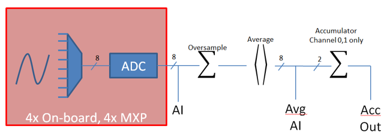

Entradas analógicas - Software
==============================

.. note:: Esta seção cobre entradas analógicas no software. Para obter um guia de hardware para entradas analógicas, consulte :ref:`docs/hardware/sensors/analog-inputs-hardware:Analog Inputs - Hardware`.

O FPGA do roboRIO suporta até 8 canais de entrada analógica que podem ser usados ​​para ler o valor de uma tensão analógica de um sensor. As entradas analógicas podem ser usadas para qualquer sensor que produz uma tensão simples.

As entradas analógicas do FPGA, por padrão, retornam um número inteiro de 12 bits proporcional à tensão, de 0 a 5 volts.

Entradas analógicas - explicação
--------------------------------

.. note:: Geralmente, é mais conveniente usar a explicação de invólucro de  :doc:`Analog Potentiometers <analog-potentiometers-software>` do que usar :code:`AnalogInput` diretamente, pois suporta o dimensionamento para unidades significativas.

O suporte para leitura das tensões nas entradas analógicas do FPGA é fornecido através da :code:`AnalogInput` explicação (`Java <https://first.wpi.edu/FRC/roborio/release/docs/java/edu/wpi/first/wpilibj/AnalogInput.html>`__, `C++ <https://first.wpi.edu/FRC/roborio/release/docs/cpp/classfrc_1_1AnalogInput.html>`__).

Sobre-amostragem e Média
^^^^^^^^^^^^^^^^^^^^^^^^

|Oversampling and Averaging|

Os módulos de entrada analógica do FPGA suportam tanto a sobre amostragem quanto a média. Esses comportamentos são altamente semelhantes, mas diferem em alguns aspectos importantes. Ambos podem ser usados ​​ao mesmo tempo.

Sobre-amostragem
~~~~~~~~~~~~~~~~

Quando a superamostragem está ativada, o FPGA adiciona várias amostras consecutivas e retorna o valor acumulado. Os usuários podem especificar o número de bits de oversampling - para nbits de oversampling, o número de amostras somadas é 2 ~ {n}.

Média
~~~~~
A média se comporta de maneira semelhante à superamostragem, exceto que os valores acumulados são divididos pelo número de amostras, para que a escala dos valores retornados não seja alterada. Isso geralmente é mais conveniente, mas ocasionalmente o erro adicional de arredondamento introduzido pelo arredondamento é indesejável.

.. note:: Quando a sobre amostragem e a média são usadas ao mesmo tempo, a sobre amostragem é aplicada primeiro e , em seguida, os valores sobre amostragem são calculados. Portanto, a superamostragem de 2 bits e a média de 2 bits usadas ao mesmo tempo aumentam a escala dos valores retornados em aproximadamente um fator de 2 e diminuem a taxa de atualização em aproximadamente um fator de 4.

Lendo valores de uma entrada analógica
^^^^^^^^^^^^^^^^^^^^^^^^^^^^^^^^^^^^^^

Os valores podem ser lidos em um AnalogInput com um dos quatro métodos diferentes:

Obter valor
~~~~~~~~~~~

O :code:`getValue` método retorna o valor medido instantâneo bruto da entrada analógica, sem aplicar nenhuma calibração e ignorar as configurações de superamostragem e média. O valor retornado é um número inteiro.

Obter voltagem
~~~~~~~~~~~~~~

O :code:`getVoltage` método retorna a tensão instantânea medida da entrada analógica. As configurações de superamostragem e média são ignoradas, mas o valor é redimensionado para representar uma tensão. O valor retornado é um dobro.

Obter valor médio
~~~~~~~~~~~~~~~~~

O :code:`getAverageValue` método retorna o valor médio da entrada analógica. O valor não é redimensionado, mas a superamostragem e a média são aplicadas. O valor retornado é um número inteiro.

Obter voltagem média
~~~~~~~~~~~~~~~~~~~~

O :code:`getAverageVoltage` método retorna a tensão média da entrada analógica. Reescalonamento, superamostragem e média são todos aplicados. O valor retornado é um dobro.

Acumulador
^^^^^^^^^^

.. note:: Atualmente, os métodos do acumulador não suportam o retorno de um valor em unidades de volts - o valor retornado sempre será um número inteiro (especificamente, a :code:`long`).

Os canais de entrada analógica 0 e 1 suportam adicionalmente um acumulador, que integra (soma) o sinal indefinidamente, de modo que o valor retornado seja a soma de todos os valores medidos passados. Sobre-amostragem e média são aplicadas antes da acumulação.

Obtendo contagem e valor sincronizados
~~~~~~~~~~~~~~~~~~~~~~~~~~~~~~~~~~~~~~

Às vezes, é necessariamente obter medições correspondentes da contagem e do valor. Isso pode ser feito usando o :code:`getAccumulatorOutput` método.

Usando entradas analógicas no código
------------------------------------
A :code:`AnalogInput` explicação pode ser usada para escrever código para uma ampla variedade de sensores (incluindo potenciômetros, acelerômetros, giroscópios, ultrassônicos e outros) que retornam seus dados como uma tensão analógica. No entanto, se possível, é quase sempre mais conveniente usar uma das outras classes WPILib existentes que manipula o código de nível inferior (lendo as tensões analógicas e convertendo-as em unidades significativas) para você. Os usuários devem usar diretamente apenas  :code:`AnalogInput` como "último recurso".

Assim, para exemplos de como usar efetivamente sensores analógicos no código, os usuários devem consultar as outras páginas deste capítulo que tratam de explicações mais específicas.

